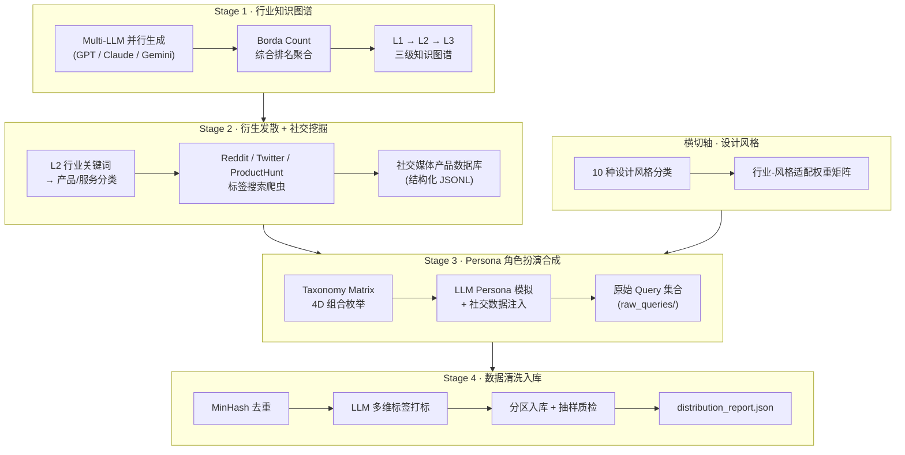

# UI 前端代码生成 · Real-World Query 数据流水线

> 目标：系统性地生成高质量、多样化、具有业务真实性的前端UI开发需求查询数据集，用于训练和评估 LLM 的前端综合设计与代码生成能力。

---

## 核心设计理念

现有前端代码生成基准（Design2Code、WebUIBench、WebGen-Bench）存在三个共同缺陷：

1. **缺乏业务语境**：测试用例来自随机网页截图，缺少"为什么要做这个产品"的业务背景
2. **设计风格盲区**：未将 UI 审美风格（玻璃拟态、极简主义等）作为独立评估维度
3. **用户角色单一**：指令均为工程化描述，缺乏产品经理/创始人/设计师等不同角色视角

本流水线通过四阶段方法，从**行业知识图谱出发**，经**社交媒体真实数据锚定**，以**角色扮演合成**为核心，生产兼顾业务多样性、用户角色多样性和设计审美多样性的查询数据。

---

## Pipeline 架构



---

## 文件结构

```
.docs/ui_query_pipeline_claude/
├── README.md                    ← 本文件：总览 + 架构 + 快速索引
├── references.md                ← [R1]-[R11] 学术文献索引
├── stage1_industry_taxonomy.md  ← Stage 1：行业知识图谱构建
├── stage2_social_divergence.md  ← Stage 2：产品衍生 + 社交媒体挖掘
├── design_style_matrix.md       ← 横切轴：设计风格分类 + 适配矩阵
├── stage3_persona_synthesis.md  ← Stage 3：Persona 合成查询
├── stage4_data_cleaning.md      ← Stage 4：清洗 / 标签 / 入库 / 质检
└── prompts/
    ├── p1_industry_generation.md   ← 行业大类生成提示词
    ├── p2_product_derivation.md    ← 产品分类衍生提示词
    ├── p3_social_extraction.md     ← 社交媒体结构化提取提示词
    ├── p4_persona_query_gen.md     ← Persona 查询合成提示词
    └── p5_quality_scoring.md       ← 质量评分提示词
```

---

## 四阶段快速概览

| 阶段 | 目标 | 核心方法 | 关键输出 |
|------|------|----------|----------|
| **Stage 1** 行业知识图谱 | 建立覆盖全域的行业分类体系 | Multi-LLM 集成 + Borda Count + 层级聚类 | `industry_graph.json` |
| **Stage 2** 衍生发散 | 锚定真实产品语境 | LLM 产品衍生 + Reddit/PH/Twitter 爬虫 | `social_db/` JSONL |
| **Stage 3** Persona 合成 | 模拟真实用户需求发送行为 | 4D Taxonomy Matrix + LLM 角色扮演 | `raw_queries/` JSONL |
| **Stage 4** 数据清洗 | 保障数据质量与分布均衡 | MinHash 去重 + LLM 打标 + 抽样质检 | `queries_clean.db` |

---

## Taxonomy Matrix 四维说明

```
Query = f(Industry_L2, Product_Type, User_Role, Design_Style)
```

- **Industry_L2**（~50 个）：来自 Stage 1 知识图谱二级节点
- **Product_Type**（13 类）：参考 WebGen-Bench [R4] 的 Web 应用分类法
- **User_Role**（6 类）：产品经理 / 独立开发者 / 创始人CEO / UI设计师 / 全栈工程师 / 外包需求方
- **Design_Style**（10 种）：见 `design_style_matrix.md`，按行业适配权重采样

理论组合空间：50 × 13 × 6 × 10 = **39,000 个独立场景象限**

---

## 设计决策

**为何要多 LLM 集成行业分类**
单一模型存在行业偏见（GPT-4o 偏北美科技生态，Gemini 偏谷歌产品体系），通过 Borda Count 聚合三个模型的排名可降低系统性偏差，参考 [R9] 的 LLM 分类方法论。

**为何社交媒体数据是必要的**
纯 LLM 生成的产品描述语言工整但缺乏真实性。社交媒体数据提供了真实产品名称、竞品对比表述、用户原生痛点语言，使 Persona 生成的 Query 更贴近真人表达，参考 [R11] 的 pain point 挖掘实践。

**为何设计风格是第四维度**
Design2Code [R1] 和 WebUIBench [R2] 均未将审美风格作为评估维度，导致现有模型对"玻璃拟态 SaaS 仪表盘"和"极简主义金融应用"的代码生成能力无法区分评估。本维度填补该研究空白。

**为何角色扮演是核心生成机制**
Persona Hub [R5] 证明"将 LLM 世界知识通过亿级 Persona 分散化激活"是扩展合成数据多样性的最有效方法，PERSONA Benchmark [R6] 进一步验证了角色扮演生成数据的质量可靠性。

---

## 文献索引

详见 [references.md](references.md)，共 11 篇核心参考文献（[R1]–[R11]）。
