# UI QueryMaker Pipeline — 论文架构图

> 面向论文展示的核心工作流方法论全景图。
> 严格基于当前仓库的实际实现，未落地的研究设想标注为 future work。

---

## 1. 端到端实现链路（Top-Level Pipeline）

当前可运行的 v2 主链路，一条命令跑通。

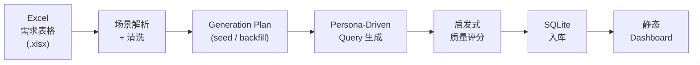

实际运行命令：

```text
npm run run:mvp
  → parseRequirementsFromWorkbook()
  → buildSeedPlan()
  → generateQueryRecords()       # 默认 persona-fallback，可选 llm-openai / llm-anthropic
  → scoreQueryRecords()
  → importIntoDatabase()
  → buildDashboardAssets()
```

---

## 2. 场景解析与清洗（Stage: Parse & Normalize）

从 Excel 原始需求到结构化场景规范。核心目标：**不让 `l2_scene_raw` 原样污染下游 query**。

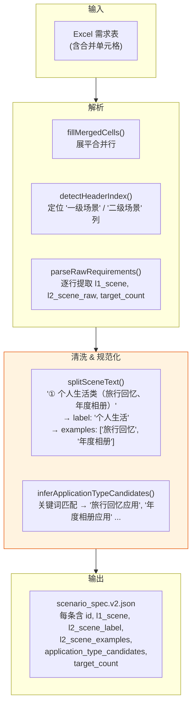

关键设计：`l2_scene_raw` 被拆为 `l2_scene_label`（语义标签）和 `l2_scene_examples`（示例列表），括号内的原始示例不会直接进入 query 文本。

---

## 3. Generation Plan 构建

Plan 阶段为每条待生成 query 预先分配维度组合，实现分布可控。

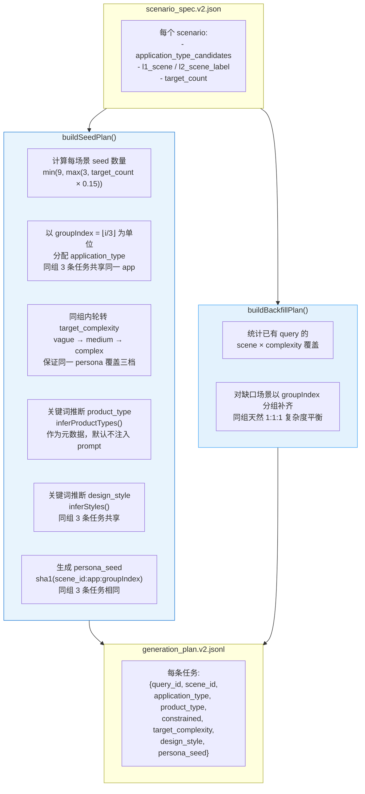

### 维度空间（实际实现）

Plan 通过关键词推断（非 LLM）组合以下维度：

```text
Query_task = f(application_type, product_type, target_complexity, design_style, persona_seed)
```

| 维度                 | 来源                          | 实际规模         |
| -------------------- | ----------------------------- | ---------------- |
| application_type     | 从 l2_scene_examples 关键词推断 + 20 条规则 | 随输入 Excel 而定 |
| product_type         | 关键词推断（元数据）；`constrained: true` 时注入 prompt | 13 种 |
| target_complexity    | 固定三档轮转                    | vague / medium / complex |
| design_style         | 关键词规则 → 10 种 + null       | 11 种            |
| persona_seed         | SHA1 确定性哈希                 | 每条唯一          |

---

## 4. Persona-Driven Query 生成（核心链路）

不直接从字段拼 query，而是 **先构造 persona，再由 persona 驱动 query 生成**。这是与模板拼接方法的关键区别。

### 4.1 默认模式：persona-fallback（确定性本地生成）

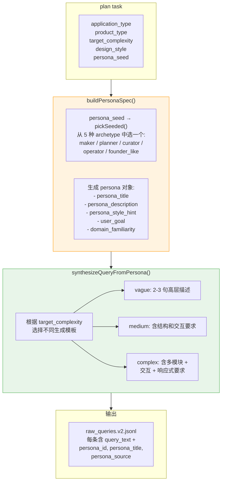

5 种 persona archetype 的设计逻辑：

| archetype      | 角色含义                 | vague 风格           | complex 风格             |
| -------------- | ----------------------- | -------------------- | ----------------------- |
| maker          | 正在自己动手做产品的人      | 口语，只给大方向         | 目标 + 内容 + 交互都讲清楚 |
| planner        | 在整理需求和表达想法的人    | 说效果不说细节          | 功能边界 + 体验目标完整    |
| curator        | 在整理内容与展示方式的人    | 在意整体感觉           | 内容结构 + 导航 + 浏览行为 |
| operator       | 需要更高效管理信息的人      | 只说想解决的问题         | 筛选 + 状态 + 异常场景     |
| founder_like   | 追求产品感觉和记忆点的人    | 描述气质和方向          | 风格 + 品牌感 + 多模块     |

### 4.2 LLM 模式：llm-openai / llm-anthropic（真实模型调用）

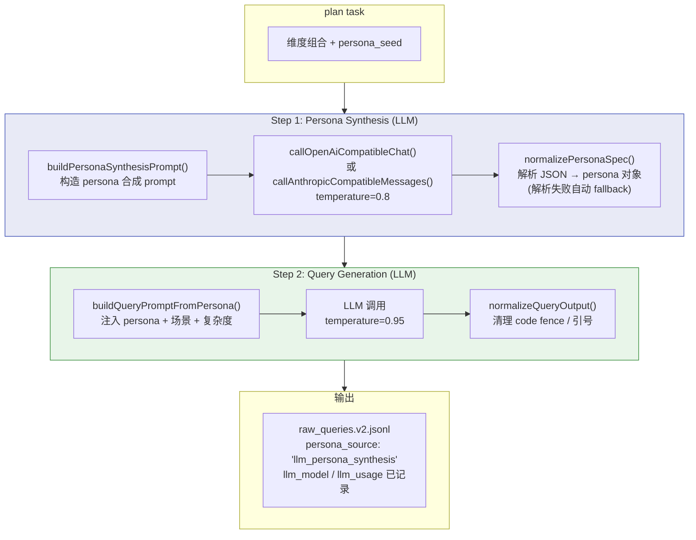

关键实现细节：
- 支持三种 transport：`claude-cli`（Claude Code CLI 子进程）、`openai`（OpenAI 兼容接口）、`anthropic`（Anthropic Messages 接口）
- **Persona 缓存**：同组 3 条任务共享同一 `persona_seed`，LLM persona 调用只发起一次，其余任务 await 同一 Promise，零重复调用
- `product_type` 默认不注入 LLM prompt（open path）；`constrained: true` 时才显式注入 persona + query 两步 prompt（supplementation path）
- 并发控制（默认 concurrency=3）+ 超时 + 重试
- Persona 解析失败时自动降级到 deterministic fallback
- Windows 系统代理自动检测 + 不安全 TLS 可选

---

## 5. 启发式质量评分

当前实现的评分是**基于规则的启发式版本**，不是 LLM 评分。

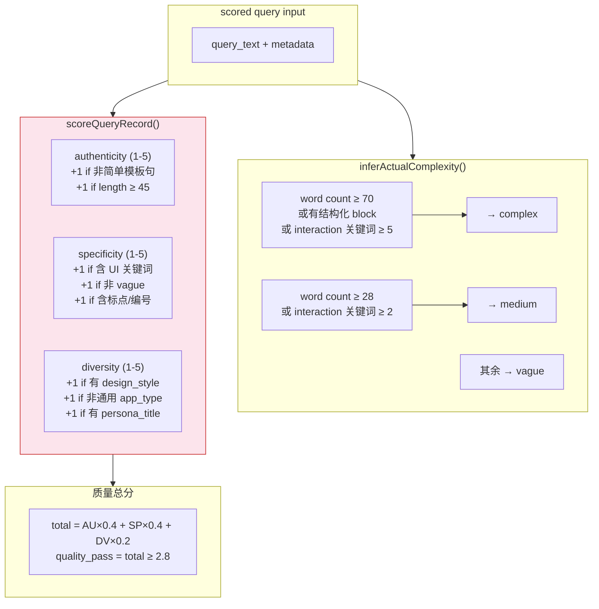

输出字段：`quality_score`、`quality_pass`、`complexity_level`（实际复杂度，用于与 `target_complexity` 对比）。

---

## 6. 数据持久化与可视化

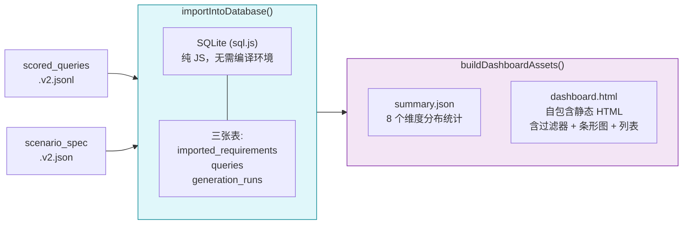

Dashboard 统计维度：
- 按一级场景 / 二级场景标签 / application_type / product_type 分布
- 按目标复杂度 / 实际复杂度分布
- 按 persona 来源 / design_style 分布
- target_complexity vs actual_complexity 交叉对比

---

## 7. 完整数据记录生命周期

一条 query 从原始 Excel 行到最终 Dashboard 的完整变换路径。

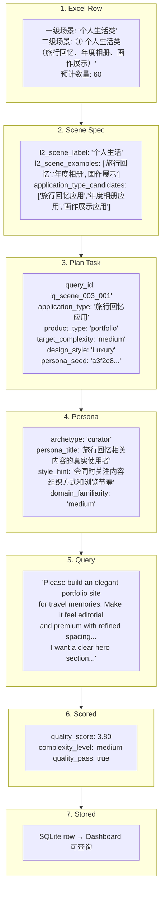

---

## 8. 生成模式对比

当前支持 4 种生成模式，覆盖从离线验证到真实 LLM 调用的完整谱系。

```mermaid
flowchart TD
    MODE{"generate:queries\n--mode ?"}

    MODE -->|persona-fallback\n(默认)| PF["确定性本地生成\npersona archetype + 模板\n无需 API Key"]
    MODE -->|llm-openai| LO["OpenAI 兼容接口\n两步 LLM 调用\npersona → query"]
    MODE -->|llm-anthropic| LA["Anthropic Messages 接口\n两步 LLM 调用\npersona → query"]
    MODE -->|template-fallback| TF["最简模板兜底\n一句话 query\n用于基线对照"]
    MODE -->|prompt-packets| PP["只输出 prompt 包\n不生成 query\n用于外接 LLM"]

    PF --> OUT["raw_queries.v2.jsonl"]
    LO --> OUT
    LA --> OUT
    TF --> OUT
    PP --> OUT

    style PF fill:#e8f5e9,stroke:#2E7D32
    style LO fill:#e3f2fd,stroke:#1565C0
    style LA fill:#ede7f6,stroke:#512DA8
    style TF fill:#fff8e1,stroke:#F57F17
    style PP fill:#efebe9,stroke:#795548
```

---

## 9. 核心设计决策

实际落地的设计选择及其背后逻辑。

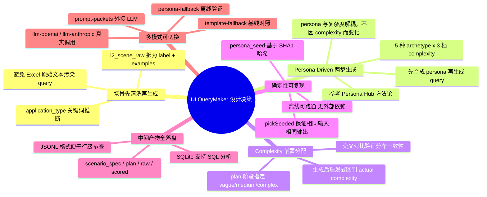

---

## 10. Prompt 资产与代码函数映射

仓库中有两套 prompt 资产，它们与运行时函数的关系不同。

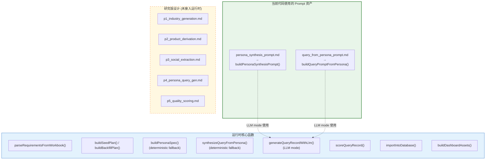

---

## 11. 方法论动机：解决现有数据集的三个盲区

本流水线的设计动机来自对现有前端代码生成基准的分析。

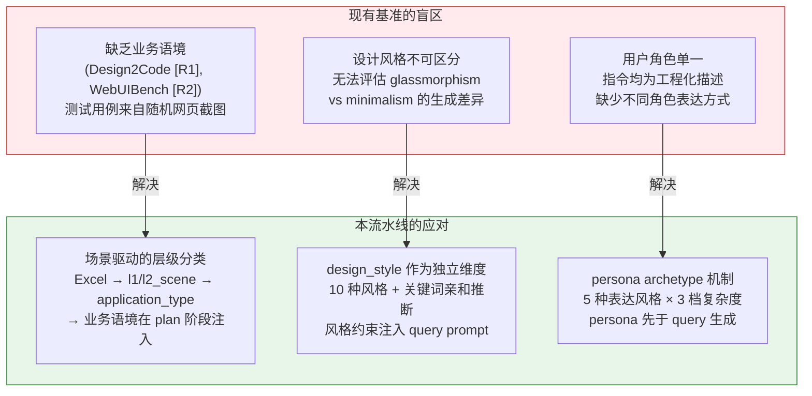

---

## 12. 已实现 vs 研究蓝图

清晰区分当前可运行实现与 ARCHIVE 中未落地的设计。


---

## 13. 关键产出文件

| 路径                                         | 内容                    | 格式      |
| -------------------------------------------- | ---------------------- | --------- |
| `data/intermediate/scenario_spec.v2.json`    | 清洗后的场景规范          | JSON      |
| `data/intermediate/generation_plan.v2.jsonl` | 首轮生成任务列表          | JSONL     |
| `data/intermediate/backfill_plan.v2.jsonl`   | 覆盖补齐任务列表          | JSONL     |
| `data/output/raw_queries.v2.jsonl`           | 生成后的原始 query       | JSONL     |
| `data/output/scored_queries.v2.jsonl`        | 带评分和复杂度标签的 query | JSONL     |
| `data/db/queries_v2.sqlite`                  | 最终分析数据库            | SQLite    |
| `data/reports_v2/summary.json`               | 8 维分布统计摘要          | JSON      |
| `data/reports_v2/dashboard.html`             | 静态可视化报表            | HTML      |

---

## 引用说明

方法论设计参考了以下工作（详见 `ARCHIVE/references.md`）：

- **Persona Hub [R5]**：persona-driven synthetic data 框架，5 种 archetype 设计的方法论来源
- **PERSONA Benchmark [R6]**：验证基于 persona 属性生成合成数据的统计可靠性
- **WebGen-Bench [R4]**：13 小类产品类型分类法，直接用于 `PRODUCT_TYPE_LABELS`
- **Design2Code [R1]** / **WebUIBench [R2]**：揭示现有基准在业务语境和设计风格上的盲区
