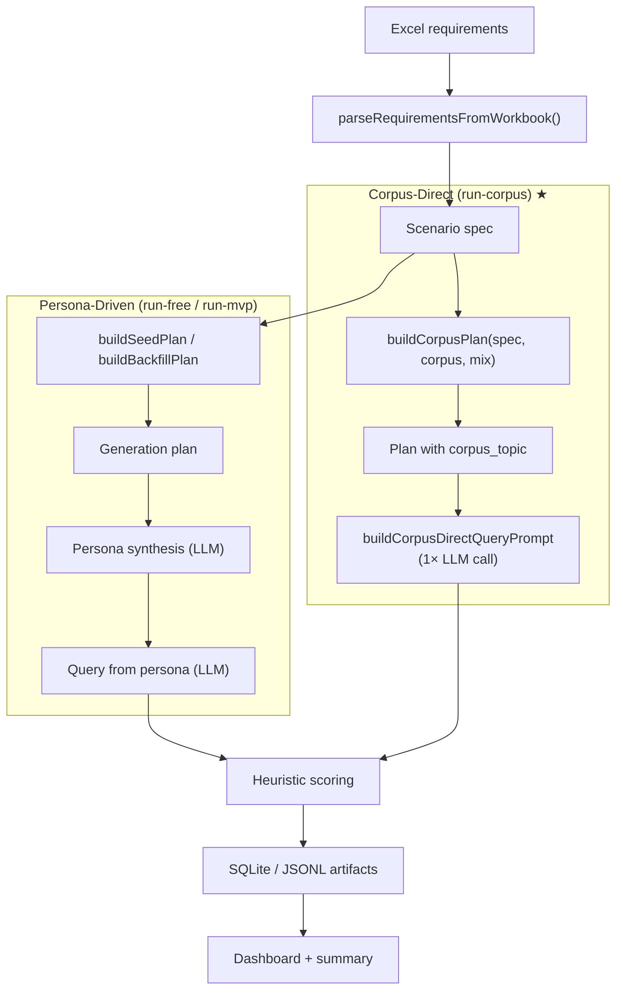
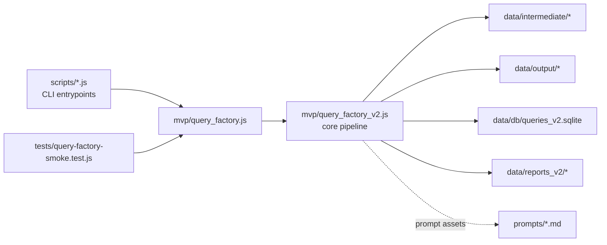

<div align="center">

# ui-queryMaker

### Realistic UI query data, synthesized with rigor.

A production pipeline for generating large, diverse, persona-grounded
natural-language queries that describe UI to be built — **corpus-anchored**,
**similarity-validated**, **design-style aware**.

> **corpus controls *what* · persona controls *who / how* — two orthogonal control signals + horizontal ablation**

[**Live Demo**](https://plevantem.github.io/queryMaker/) ·
[Quick Start](#quick-start) ·
[vs Persona Hub](#how-this-compares-to-persona-hub--self-instruct--magpie) ·
[Method Comparison](#method-comparison) ·
[Limitations](#limitations-were-honest-about) ·
[Architecture](#architecture)

[简体中文](./README.md) · **English**

[](#license)
[](https://nodejs.org/)
[](https://www.anthropic.com/)
[](#method-comparison)
[](https://github.com/PlevanTem/queryMaker/stargazers)
[](https://github.com/PlevanTem/queryMaker/commits)

</div>

---

## At a Glance

| Metric | Value | Notes |
| --- | --- | --- |
| Corpus coverage | **2,440 topics** | 61 L2 scenes · 12 L1 categories |
| Run success rate | **200 / 200** | 0 failures on `claude-sonnet-4-6` |
| Avg query length | **~84 words** | medium complexity, English |
| Per-query latency | **~3.3s** | 200 queries in ~11 minutes (≈ 1080/hour) |
| External API cost | **$0** (no-API mode) | via Claude Code subagents; packy path billed per token |
| Cross-batch topic overlap | **0%** (since Stage 2) | Layer-A `corpus_usage.json` least-used-first state |

> Under a 4-way controlled-variable ablation (`llm-direct` / `corpus-direct` / `persona-direct` / `corpus+persona`),
> **`corpus-direct` reaches the Pareto optimum**: 100% topic-hit (vs `persona-only` ≈70%) ·
> 5 ordinary-user archetypes × 11 registered design styles = **55 style combinations** ·
> "Build a" opener share naturally diffused to 21% (vs 54% on the naive baseline).
> Full comparison + control-variable details → [§Method Comparison](#method-comparison).

## How this compares to Persona Hub / Self-Instruct / Magpie

Synthetic-data research has roughly four lines: **instance-driven** (Self-Instruct / Evol-Instruct),
**key-point-driven** (GLAN), **persona-driven** (Persona Hub), **self-play** (Magpie).
This repo sits on the **persona-driven** line and adds three engineering reinforcements the original
paper did not include:

| Dimension | Persona Hub (Tencent AI Lab, 2024) | This repo |
| --- | --- | --- |
| **Persona source** | Generic 1B persona pool reverse-derived from web text | **5 targeted archetypes** reverse-derived from product scenarios + real user profiles |
| **Distribution control** | Black-box: relies on a large persona pool's natural spread | **White-box**: corpus channel tracks 2,440 topic distribution, Layer-A least-used pickup |
| **Horizontal ablation** | No with/without-persona ablation; no head-to-head vs Self-Instruct / Magpie | **4-way ablation**: `llm-direct` / `corpus-direct` / `persona-direct` / `corpus+persona` |
| **Typical setting** | General-domain distillation at scale | **Vertical product domain** (UI vibe-coding) — where you can actually obtain a clean corpus |

> Persona Hub's headline evidence is "1M-persona synthesis trains a 7B model to approach GPT-4-turbo on MATH"
> — that is end-to-end *result* evidence, but it does not directly isolate the marginal contribution of
> the *persona mechanism itself* relative to other synthesis routes.
> This repo fills that ablation gap via [§Method Comparison](#method-comparison) and adds a **corpus channel**
> for white-box distribution anchoring that the original paper lacks.

→ Methodology lineage and full references: [§Key References](#key-references--acknowledgements).

## Method Comparison

> This is the ablation Persona Hub did not run — under **same base model** (`claude-sonnet-4-6`) /
> **same query total** / **same eval protocol**, four generation strategies head-to-head.
> Controls + raw data: `scripts/test-corpus-methods.js` and `data/output/corpus_method_comparison.html`.

| Method | Topic-hit | Avg length | Template residue | Contribution |
| --- | --- | --- | --- | --- |
| `llm-direct` (= `scene-direct`) | ~75% | 71 words | medium | Baseline lower bound: L2 scene name only, free LLM generation |
| **`corpus-direct`** ★ | **100%** | 84 words | very low | Isolates the ***what*** channel (corpus) contribution |
| `persona-only` | ~70% | 92 words | low | Isolates the ***who / how*** channel (persona) contribution |
| `persona+corpus` | ~95% | 96 words | low | Both channels stacked; highest cost, marginal vs `corpus-direct` |

**How to read this table**:
- `corpus-direct` vs `llm-direct` = corpus-anchoring net contribution (*what* channel): topic-hit 75% → 100%.
- `persona-only` vs `llm-direct` = persona-injection net contribution (*who / how* channel): voice and template-residue improve, but topic discipline regresses.
- `persona+corpus` vs `corpus-direct` = marginal output of the second LLM call (small) — production recommends `corpus-direct`, folding the persona signal into a single prompt.

See the [Live Demo](https://plevantem.github.io/queryMaker/) for the full benchmark write-up, or open
`data/output/corpus_method_comparison.html` after running `scripts/test-corpus-methods.js`.

## Why this exists

Most "let's just prompt an LLM for some queries" pipelines collapse into narrow,
templated distributions that don't generalize.

Synthetic queries have two goals **a single signal cannot cleanly cover at the same time** —
*what to ask about* (scene skeleton / topic distribution) and
*who is asking and how* (asker viewpoint / phrasing style).
The first is controlled by the **corpus channel**; the second by the **persona channel**.
Their Cartesian-product composition maximizes coverage.

| What goes wrong without it | What this repo does instead |
| --- | --- |
| **Narrow distribution** — 100 variations of "build me a dashboard" covering &lt;5% of real product space | **Real-world corpus anchoring** (*what* channel) — each generation locks to a specific topic from a curated 2,440-entry corpus |
| **Robotic phrasing** — a single polite, structured voice that doesn't match how humans request UI | **Persona-driven voice** (*who / how* channel) — five archetypes × three complexity tiers produce first-person variation grounded in user goals |
| **Visually flat output** — queries rarely specify visual style, leaving downstream UI generation to one aesthetic | **Design-style aware** — 11 registered design styles × three invocation modes (default / fixed / heuristic-auto) |

## Who this is for

Three concrete usage angles — each maps to a real situation where someone needs "a batch of high-quality query data":

| Angle | Who / when | What you get |
| --- | --- | --- |
| **🏭 Industry · Product** | Teams building NL → mini-app code products (Bolt, v0.dev, Builder.io, ByteDance Doubao, Ant Lingguang, etc.) | Drop-in seed query train/eval set: 2,440 topics × 5 personas × 11 design styles, distribution faithful to scene weights, framed as 0-to-1 mini-apps (not single-page mocks) |
| **🎓 Research** | Synthetic-data, instruction-tuning, and UI code-generation researchers | Controlled-variable benchmark (`test-corpus-methods.js`) showing additive corpus-anchoring + persona effects; 4-method comparison and three diversification layers (Layer-A dedup / opener hash / persona-tone) all open-sourced — directly reproducible or usable as a baseline |
| **🛠 Industry · Internal teams** | ML / engineering teams that need "a batch of seed queries, fast" | ~3.3s per query · ~7 min for 200 · cross-batch dedup state · bilingual (EN + 简体中文) xlsx out-of-the-box. Useful for prompt iteration, UX test sets, pre-launch API stress tests, internal product demos |

Out of scope: general LLM benchmarks, UI design-mock evaluation, vision-model training. This repo focuses purely on the *query side* of realistic distribution synthesis.

## Highlights

- **Two orthogonal control signals** — corpus controls *what* (scene skeleton / topic distribution) · persona controls *who / how* (asker viewpoint / phrasing style)
- **4-way horizontal ablation** — `llm-direct` / `corpus-direct` / `persona-direct` / `corpus+persona` — the engineering reinforcement Persona Hub's original paper did not include
- **No-API mode** — uses Claude Code subagents; mobile/web 500-each datasets shipped at $0 external API spend
- **Cross-batch dedup state** — Layer-A `corpus_usage.json` keeps cross-batch topic overlap at **0%**
- **Deterministic offline fallback** — `persona-fallback` runs the pipeline without any LLM; useful for smoke tests and CI

## Quick Start

```bash
# 1. Install
npm install

# 2. Run the offline MVP (no LLM, deterministic fallback)
npm run run:mvp

# 3. View results
open data/reports_v2/dashboard.html
```

**With a real LLM** — drop credentials into `.env.local` and pick a pipeline:

```bash
# Corpus-Direct (recommended for production)
node scripts/run-corpus.js --total 200

# Persona-Driven free generation (research / experimentation)
npm run run:free
```

### 🆕 No-API mode (recommended · uses Claude Code subagents, zero quota cost)

When you have **no LLM API key**, your **packy balance is exhausted**, or you simply
want a **fully free** run, use Claude Code itself as the LLM. Generation and
translation are split into batches; each batch is processed by an in-process
subagent (`Task` tool · `model="sonnet"` for generation, `"haiku"` for
translation). The full **mobile 500 + web 500** dataset shipped in this repo
was produced this way at $0 of external API spend.

```bash
# Step 1 (in Claude Code chat): prep batches
node scripts/run-corpus.js --total 500 --platform mobile --prep-only \
  --out data/output/my_run_mobile_500
# → writes plan.jsonl + placeholder queries.jsonl + _subagent_in/<platform>_b<NN>_in.json

# Step 2 (auto): I spawn N Sonnet subagents, one per *_in.json,
#         each writing its corresponding *_out.json

# Step 3: merge subagent output back into queries.jsonl
node scripts/merge-subagent-retry.js \
  --in-dir     data/output/my_run_mobile_500/_subagent_in \
  --target-dir data/output/my_run_mobile_500
# → 500/500 OK, error stub rows replaced with real queries
```

**Translation flow mirrors the same pattern**:

```bash
# Step 1: split queries.jsonl into Haiku batches
node scripts/prep-translate-batches.js --dir data/output/my_run_mobile_500

# Step 2 (in Claude Code): spawn Haiku subagents per *_in.json

# Step 3: repair (Haiku occasionally emits unescaped " inside Chinese) + merge
node scripts/repair-haiku-json.js --dir data/output/my_run_mobile_500/_translate_in
node scripts/merge-haiku-translations.js \
  --temp-dir data/output/my_run_mobile_500/_translate_in
# → query_text_zh column added to queries.jsonl + queries.xlsx
```

**Why this is the preferred path**:
- ✅ **Zero external cost** — no API spend, no rate-limit, no quota juggling
- ✅ **Naturally parallel** — Claude Code happily runs 6-15 subagents concurrently
- ✅ **Same quality as packy path** — same corpus-direct prompt, Sonnet 4.6 directly
- ✅ **Resumable per batch** — if one subagent fails, only re-spawn that batch
- ✅ **Audit-friendly** — every batch's prompt + output is plain JSON on disk

<details>
<summary><b>Full .env.local template</b></summary>

```bash
# OpenAI-compatible gateway (Packy / LiteLLM / self-hosted)
PACKY_API_KEY=your_api_key_here
PACKY_BASE_URL=https://www.packyapi.com/v1
PACKY_MODEL=claude-3-5-sonnet-20240620

# Anthropic / Claude-Code style (CC group token)
ANTHROPIC_AUTH_TOKEN=your_cc_group_token_here
ANTHROPIC_BASE_URL=https://www.packyapi.com
ANTHROPIC_MODEL=claude-sonnet-4-6

# Concurrency / network
PACKY_CONCURRENCY=3
PACKY_TIMEOUT_MS=120000
PACKY_MAX_RETRIES=2
PACKY_USE_SYSTEM_PROXY=1
PACKY_ALLOW_INSECURE_TLS=0
```

Notes:
- `llm-openai` / `real-llm` / `packy-openai` → OpenAI-compatible call
- `llm-anthropic` / `claude-code` / `anthropic-cc` / `packy-cc` → Anthropic-style `/v1/messages`
- LLM calls use Node's built-in `undici`; no extra SDK required
- On Windows, system proxy is auto-detected; set `PACKY_USE_SYSTEM_PROXY=0` for intranet gateways

</details>

## Two Pipelines

The repo ships two production paths, sharing scoring, dedup, and reporting:

| | Corpus-Direct ★ | Persona-Driven |
| --- | --- | --- |
| Entry | `node scripts/run-corpus.js` | `npm run run:free` |
| LLM calls per task | **1** | 2 (persona → query) |
| Anchoring | Real-world topic from 2,440-entry corpus | Synthesized persona + scene |
| Topic-hit rate | **100%** | ~70–85% (drifts within L2 category) |
| Best for | Production datasets, distribution-faithful corpora | Research, voice diversity exploration |



## Iteration Story: 4 stages, 4 fixes

This wasn't a single shot — each stage is a real production-grade pain that surfaced *only after* running the previous version at scale, then a focused prompt or pipeline fix. The trail itself is more instructive than any single prompt-engineering snippet.

### Stage 1 — Naive baseline (no scaffolding)

No persona, no opener distribution, no scope discipline. Same first-N corpus topics get reused across batches; **"Build a mobile X" template dominates**; queries framed as a single page or screen, not a 0-to-1 app.

### Stage 2 — Three-layer diversification ([commit 040a427](https://github.com/PlevanTem/queryMaker/commit/040a427))

| Fix | Layer-A least-used topic dedup across batches via `corpus_usage.json` state · 5-bucket opener hash keyed by `query_id` · persona-tone semantic mapping from L2 → 5 ordinary-user archetypes |
|---|---|
| **Result** | Cross-batch corpus-topic overlap **100% → 0%**; "Build a" share **54% → 21%**; 5 distinct persona voices visible in batch |
| **New pain** | Audit found **49.5% of queries** still framed as "Build a XX page where…" — opener now diverse but scope noun still page-level, causing downstream LLMs to generate single-page mocks |

### Stage 3 — App-scope rewrite ([commit 07ed4af](https://github.com/PlevanTem/queryMaker/commit/07ed4af))

| Fix | New rule 7 forbids `page / screen / view / section / module / feature / widget` as the top-level scope noun. Use `app` or a specific app type (`tracker / tool / reminder / planner / calculator / logger / manager / timer`) |
|---|---|
| **Result** | Single-page-framed queries **49.5% → 0%**; average word count unchanged (91 → 91, no length inflation) |
| **New pain** | Audit found **76% of EN / 80% of ZH queries** contained negation words; **45% had outright grievance dump patterns** ("no stock photo, no cartoon, no confetti…") |

**Real sample (v5 founder_like, wedding card creator) — BEFORE**:

> Make a wedding invitation card creator that feels personal and handcrafted, **not like** some cookie-cutter template factory — I want a small set of maybe four or five elegant layouts I can actually customize with our names, date, and a short line of text, and the font choices should lean traditional and warm, **not** trendy sans-serif stuff. **No** stock photo backgrounds, **no** cartoon illustrations, **no** confetti animations — just clean, tasteful design with maybe a soft floral border option. It should feel like something I made myself, **not** something that came off an assembly line.

### Stage 4 — Positive-framing rewrite · current ([commit ee04965](https://github.com/PlevanTem/queryMaker/commit/ee04965))

| Fix | (1) Rewrote `founder_like` voice — was literally instructed to "explain what NOT to include as much as what to include" · (2) Flipped 3 "Do NOT" prompt rules to positive form ("Open with the substance" / "Use everyday vocabulary" / "Use 'app' as top-level noun") · (3) Added explicit positive-framing rule limiting negation words to ≤1 per query |
|---|---|
| **Result** | NEG words / query **1.08 → 0.66 (-39%)**; **grievance patterns 0.58 → 0.22 (-62%)**; by persona: curator **-56%**, maker **-57%**, planner **-39%**; residual negations are now feature-value descriptions ("auto-saves so you never lose"), not grievance dumps |

**Real sample (v6 founder_like, ATS resume builder — same persona, same L2) — AFTER**:

> Create a resume builder app that has its own quiet identity — one of those tools you actually feel good using — built around a small, carefully chosen set of ATS-friendly templates that are clean but still carry a bit of character, where I can fill in my experience and skills section by section and watch a live preview come together in a format that looks genuinely considered to a human reader while staying structured enough for automated hiring systems to parse without a fuss.

**Why this matters**: every stage is a single, focused commit on `main` — fully reproducible. Quantitative deltas are computed against the same persona breakdown so improvements are not just topic luck. Interactive timeline with collapsible before/after samples lives in the [Live Demo Evolution section](https://plevantem.github.io/queryMaker/#evolution).

## Architecture

Core logic is centralized; CLIs are thin wrappers.



- `scripts/` — staged CLI entry points (arg parsing, path conventions, file IO)
- `mvp/` — all runnable core logic
- `prompts/` — prompt assets (persona pipeline + research-version stages)
- `data/` — intermediate, output, SQLite, dashboards
- `tests/` — smoke tests covering the main path
- `ARCHIVE/` — methodology background and research blueprint (not 1:1 with code)

## Design Style System

`design_style` defaults to `null` — the LLM picks visual direction from context.
Three opt-in modes are available:

| Mode | Behavior |
| --- | --- |
| (default) | `design_style: null`, LLM infers from scene context |
| `--design-styles "Dark,Glassmorphism,Cyberpunk"` | round-robin from the list |
| `--design-styles auto` | heuristic inference from L1/L2/app keywords |

11 styles registered out of the box: `Dark`, `Glassmorphism`, `Neumorphism`,
`Neubrutalism`, `Minimalism`, `Material`, `Data-Dense`, `Cyberpunk`, `Luxury`,
`Vibrant`. Extend with `registerDesignStyle()` — registration updates `DESIGN_STYLES`,
Chinese persona hints, and English prompt instructions simultaneously.

<details>
<summary><b>Project Layout</b></summary>

```text
.
├── README.md / README.en.md
├── MVP_QUERY_FACTORY.md
├── docs/index.html                    # ★ Public landing page (GitHub Pages)
├── package.json
├── mvp/
│   ├── query_factory.js
│   └── query_factory_v2.js            # core: pipeline / scoring / design_style
├── scripts/
│   ├── README.md                      # CLI args / examples / design principles
│   ├── lib/
│   │   ├── llm-batch.js               # transports / retries / persona pipeline / concurrency pool
│   │   └── claude-cli.js              # ★ claude CLI subprocess (bypasses CC gateway UA check)
│   ├── corpus_data.json               # ★ 61 L2 × ~40 corpus topics
│   ├── build_corpus.py                # corpus build script
│   ├── gen_html.py                    # corpus visualization
│   ├── run-corpus.js                  # ★ Corpus-Direct one-shot pipeline (production)
│   ├── test-corpus-methods.js         # 4-method comparison benchmark
│   ├── run-free.js                    # ★ LLM free-generation one-shot pipeline
│   ├── batch-generate-queries.js      # LLM batch generation (called by run-free)
│   ├── build-free200-plan.js          # ★ Free-generation plan (200 tasks, persona-scope aware)
│   ├── build-expand200-plan.js        # Divergent expansion plan (200, 3-part structure)
│   ├── generate-analysis-report.js    # ★ Batch quality analysis HTML (persona cards)
│   ├── score-queries.js
│   ├── export-queries-csv.js          # ★ Export queries with prefix as CSV
│   ├── build-query-comparison.js
│   ├── generate-extra-scenes.js       # Expand L2 scenes from L1 (41 new)
│   ├── test-api-connectivity.js
│   ├── parse-requirements.js
│   ├── build-generation-plan.js
│   ├── build-backfill-plan.js
│   ├── generate-queries.js
│   ├── supplement-anchored-persona-queries.js
│   ├── import-queries.js
│   ├── build-dashboard.js
│   ├── preview-persona-flow.js
│   ├── run-mvp.js                     # Legacy one-shot (persona-fallback, no LLM)
│   └── legacy/                        # Archived one-off scripts
├── prompts/
│   ├── persona_synthesis_prompt.md
│   ├── query_from_persona_prompt.md
│   └── generate_corpus_prompt.md
├── ARCHIVE/                           # Research-version methodology (p1–p5)
├── tests/
│   └── query-factory-smoke.test.js
└── data/
    ├── intermediate/
    ├── output/
    │   ├── corpus_run/                # ★ Corpus-Direct outputs
    │   ├── corpus_method_comparison.html
    │   └── runs/
    │       ├── expand200_llm/
    │       └── free200_llm/           # ★ Free-generation batch outputs
    ├── db/
    └── reports_v2/
```

</details>

<details>
<summary><b>CLI Reference</b></summary>

| Command | Purpose |
| --- | --- |
| `npm run parse:requirements` | Parse Excel → normalized scenario spec |
| `npm run plan:seed` | Generate first-round seed plan |
| `npm run plan:backfill` | Generate backfill plan for under-covered scenes |
| `npm run generate:queries` | Generate queries from plan |
| `npm run preview:persona` | Preview single-task persona + query generation |
| `npm run score:queries` | Heuristic quality scoring |
| `npm run import:queries` | Import scenes + queries into SQLite |
| `npm run build:dashboard` | Build static dashboard from SQLite |
| `npm run run:mvp` | Legacy one-shot (persona-fallback, no LLM) |
| `npm run run:free` | ★ LLM free-generation one-shot (persona-driven) |
| `node scripts/run-corpus.js` | ★ Corpus-Direct one-shot (production) |
| `npm run batch:generate` | LLM batch generation (single step, resumable) |
| `npm run build:comparison` | Side-by-side comparison HTML across batch runs |
| `npm run test:api` | Probe Anthropic + OpenAI-compatible endpoints |
| `npm test` | Smoke tests |

**Direct script invocation:**

```bash
# Corpus-Direct
node scripts/run-corpus.js --total 200 --complexity-mix "vague,medium,medium"
node scripts/run-corpus.js --total 200 --dry-run                          # plan only
node scripts/run-corpus.js --total 200 --limit 10                          # small live run

# Free generation
node scripts/run-free.js --output-dir data/output/runs/free200_v2 --no-resume --export-csv

# Plans
node scripts/build-free200-plan.js [--persona-scope scene|task]
node scripts/build-expand200-plan.js [--design-styles "Dark,Glassmorphism"]

# Reports
node scripts/generate-analysis-report.js \
  --input  data/output/runs/<batch>/scored_queries.jsonl \
  --output data/output/runs/<batch>/analysis_report.html
```

</details>

## How Scoring Works

`scoreQueryRecord()` applies per-complexity heuristics:

- **`vague`** — 5–40 words, contains app-type token, no trailing question, no sign-off
- **`medium` / `complex`** — UI component vocabulary, sentence structure, complexity alignment
- **Formula** — `Authenticity × 0.4 + Specificity × 0.4 + Diversity × 0.2`, passing threshold ≥ 2.8
- **`design_style` impact** — bumps Diversity by +1 when present; max Diversity = 4 when `null`

## Limitations We're Honest About

Synthetic data has edges — credibility lives on a multi-indicator evidence net, so the edges go up front:

- **Persona pool is currently 5 archetypes** — chosen via L2 semantic best-fit within the UI product
  domain. Good coverage on the head; long-tail user representativeness still needs reverse validation
  against real user logs.
- **Diversity is currently measured at the lexical (trigram-Jaccard) and corpus-distribution layers only**.
  Deeper evidence at the semantic / task-distribution / discriminator layer is out of scope for this repo.
- **No end-to-end downstream validation** — the ultimate evidence ("model capability gain when this data
  is added to training") is not in scope here due to downstream training resource limits. Adopters
  should run a controlled comparison in their own training setting.
- **Where the L2 corpus is narrow, the persona channel cannot compensate** — mode collapse can still
  happen under that condition. Known narrow scenes are flagged in `data/intermediate/scenario_specs/`;
  the recommendation is to grow the corpus rather than stack more personas.
- **Authenticity evaluation currently relies on design-expert blind review + heuristic scoring**
  (authenticity / specificity / diversity, 3-axis). Cold-metric counterparts (discriminator AUC,
  distribution distance) are not yet in place.

> Listing these is not self-sabotage — it's putting credibility on a multi-indicator evidence net, and
> it tells adopters which piece they should reinforce in their own setting.

## Roadmap

- [ ] LLM-based quality scoring (replace heuristic with `p5` design)
- [ ] End-to-end research pipeline (Stage 1 → Stage 4 auto)
- [ ] Distribution-aware backfill (replace per-scene with per-hotspot)
- [ ] Online service / scheduled batch
- [ ] Dedup at training-set scale (currently trigram, batch-level)

## Status

**Implemented**

- Excel → scenario spec parsing
- Seed + backfill plan generation (grouped tasks share persona)
- Persona-driven fallback generation (offline)
- LLM two-step generation across three transports (`claude-cli` / `openai` / `anthropic`)
- Corpus-Direct production pipeline (single-call, topic-anchored)
- 4-method benchmark with controlled conditions
- Heuristic scoring (per-complexity, design-style aware)
- Design-style system (11 styles, three invocation modes, dynamic registration)
- Reusable analysis-report skill (interactive HTML with persona cards)
- Free-generation pipeline (`run-free`, persona-scope control)
- CSV export with custom prefix
- SQLite import + static dashboard
- Smoke tests

**Not yet end-to-end**

- LLM-based scoring from `p5`
- Full Stage 1 → Stage 4 automation
- Online service / job orchestration

## Key References & Acknowledgements

This project stands on a few research lines. The **methodology lineage** roughly is:
Self-Instruct (2022) → Evol-Instruct (2023) → Magpie (2024) → Persona Hub (2024) → this repo
(two channels + white-box distribution anchoring + 4-way ablation).

Each entry below includes a concrete "what we borrowed" note plus "how this repo differs", so adopters
can locate the idea source and adjacent researchers can cross-reference.

### Synthetic-data route lineage (baseline panorama)

- **Self-Instruct: Aligning Language Models with Self-Generated Instructions** — Wang et al., 2022. [arXiv:2212.10560](https://arxiv.org/abs/2212.10560) — origin of *instance-driven* synthesis: diffuse from seed samples.
- **Evol-Instruct / WizardLM** — Xu et al., 2023. [arXiv:2304.12244](https://arxiv.org/abs/2304.12244) — adds complexity evolution on top of instance-driven.
- **Magpie: Alignment Data Synthesis from Scratch by Prompting Aligned LLMs with Nothing** — Xu et al., 2024. [arXiv:2406.08464](https://arxiv.org/abs/2406.08464) — *self-play* route: directly samples the LLM's internal distribution without a prompt-side control signal.

### Persona-driven synthetic data (this project's methodology anchor)

- **Scaling Synthetic Data Creation with 1,000,000,000 Personas** (PersonaHub) — Tao Ge, Xin Chan, Xiaoyang Wang, Dian Yu, Haitao Mi, Dong Yu. Tencent AI Lab, 2024. [arXiv:2406.20094](https://arxiv.org/abs/2406.20094) · [code](https://github.com/tencent-ailab/persona-hub)
  - **What we borrowed**: the framing that "persona is the LLM's internal multi-perspective index, and the right intermediate abstraction for synthesis diversity". We adopt this as the *who / how* channel anchor.
  - **How this repo differs** (expanded in §[How this compares to Persona Hub](#how-this-compares-to-persona-hub--self-instruct--magpie)):
    (1) Not a generic 1B persona pool — instead **5 targeted archetypes** (`maker / planner / curator / operator / founder_like`) reverse-derived from real user profiles, assigned to tasks by L2 semantic best-fit;
    (2) Adds a **corpus channel** the original paper does not have, for white-box distribution anchoring (Layer-A `corpus_usage.json` least-used-first state);
    (3) Fills in the **4-way horizontal ablation** the original paper does not run (`llm-direct` / `corpus-direct` / `persona-direct` / `corpus+persona`), quantifying the marginal contribution of each channel.

### Instruction-tuning data synthesis

- **Instruction-Tuning Data Synthesis from Scratch via Web Reconstruction (WebR)**, 2025. [arXiv:2504.15573](https://arxiv.org/abs/2504.15573)
  - The "Web as Instruction / Web as Response" duality directly informs our `corpus-direct` pipeline: reconstruct realistic instructions from raw corpus seeds (xlsx scenario specs + 2,440 topics) via a single LLM step, instead of template stitching.

- **Instruction Tuning for Large Language Models: A Survey** — Shengyu Zhang, Linfeng Dong, Xiaoya Li, Sen Zhang, Xiaofei Sun, Shuhe Wang, Jiwei Li, Runyi Hu, Tianwei Zhang, Fei Wu, Guoyin Wang. *ACM Computing Surveys*, 2025.
  - Comprehensive survey of instruction-tuning data construction, quality assessment, and diversity metrics. Our authenticity / specificity / diversity 3-axis scoring rubric and the trigram-Jaccard within-scene peer dedup follow this paper's taxonomy.

### Downstream UI / Web code-generation goal

- **WebGen-Bench: Evaluating LLMs on Generating Interactive and Functional Websites from Scratch**, 2025. [arXiv:2505.03733](https://arxiv.org/abs/2505.03733)
  - Defines our acceptance criterion for the produced query dataset: queries should drive an LLM to generate a runnable 0-to-1 mini-app, not a single-page mock. Our recent "app-scope rewrite" (forbidding `page / screen / view` as the top-level noun, requiring `app / tracker / tool / reminder` etc.) was made specifically to align with this evaluation target.

- **Code Aesthetics with Agentic Reward Feedback** — Bang Xiao, Lingjie Jiang, Shaohan Huang, Tengchao Lv, Yupan Huang, Xun Wu, Lei Cui, Furu Wei. Microsoft, 2025. [arXiv:2510.23272](https://arxiv.org/abs/2510.23272)
  - Reminded us that a query carries aesthetic intent, not just functionality. Our 11 registered design styles (`Glassmorphism / Neumorphism / Cyberpunk / ...`) and the prompt rule that style hints should integrate naturally into the query (not be listed mechanically) ride the same wave as this work's "aesthetic feedback" idea.

---

If this project helps your synthetic-data, instruction-tuning, or UI/web code-generation baseline work, please open an issue describing your scenario — we're genuinely interested in real downstream usage and that's how the project evolves. Stars and forks welcome; usage is governed by [LICENSE](./LICENSE).

> Want to contribute code? Pass `npm install && npm test`, skim [`scripts/README.md`](./scripts/README.md) for the CLI design contract, and open an issue before larger refactors.

## Star History

<a href="https://star-history.com/#PlevanTem/queryMaker&Date">
  <picture>
    <source media="(prefers-color-scheme: dark)" srcset="https://api.star-history.com/svg?repos=PlevanTem/queryMaker&type=Date&theme=dark" />
    <source media="(prefers-color-scheme: light)" srcset="https://api.star-history.com/svg?repos=PlevanTem/queryMaker&type=Date" />
    
  </picture>
</a>

## License

[ISC](./LICENSE) © 2026 ui-queryMaker contributors

---

<div align="center">

**[Live Demo](https://plevantem.github.io/queryMaker/)** ·
**[简体中文](./README.md)** ·
**[Report a bug](https://github.com/PlevanTem/queryMaker/issues)**

</div>
