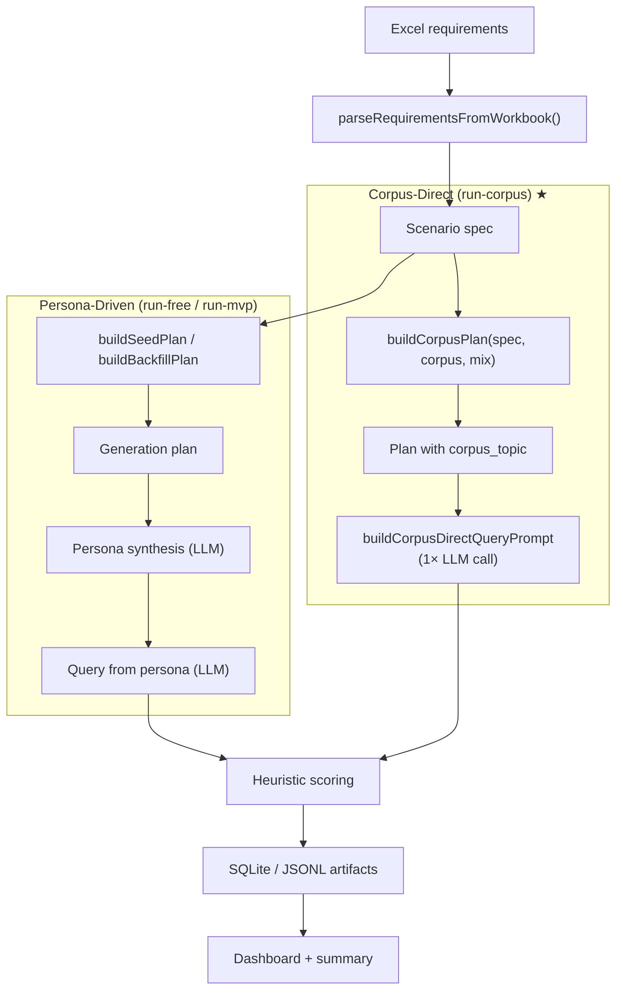
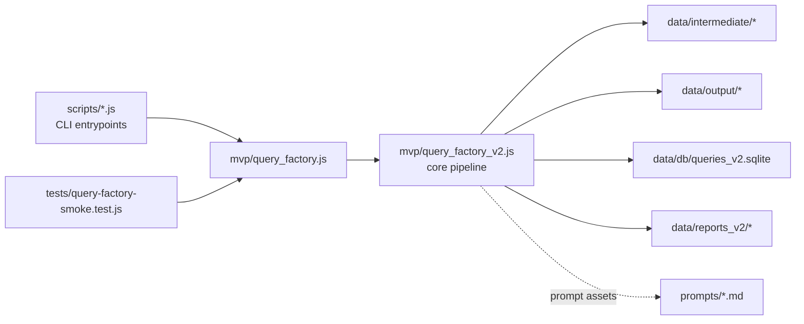

<div align="center">

# ui-queryMaker

### Realistic UI query data, synthesized with rigor.

A production pipeline for generating large, diverse, persona-grounded
natural-language queries that describe UI to be built — **corpus-anchored**,
**similarity-validated**, **design-style aware**.

[**Live Demo**](https://plevantem.github.io/queryMaker/) ·
[Quick Start](#quick-start) ·
[Pipelines](#two-pipelines) ·
[Method Comparison](#method-comparison) ·
[Architecture](#architecture)

[简体中文](./README.md) · **English**

[](#license)
[](https://nodejs.org/)
[](https://www.anthropic.com/)
[](https://github.com/PlevanTem/queryMaker/stargazers)
[](https://github.com/PlevanTem/queryMaker/commits)

</div>

---

## At a Glance

| Metric | Value | Notes |
| --- | --- | --- |
| Corpus coverage | **2,440 topics** | 61 L2 scenes · 12 L1 categories |
| Run success rate | **200 / 200** | 0 failures on `claude-sonnet-4-6` |
| Avg query length | **~84 words** | medium complexity, English |
| Per-query latency | **~3.3s** | 200 queries in ~11 minutes |

> Four generation strategies were benchmarked under controlled conditions.
> Human review picked **`corpus-direct` as the highest-quality method** —
> 100% topic-hit rate, lowest template-residue, strongest diversity.

## Why this exists

Most "let's just prompt an LLM for some queries" pipelines collapse into narrow,
templated distributions that don't generalize. ui-queryMaker attacks that on three axes:

| What goes wrong without it | What this repo does instead |
| --- | --- |
| **Narrow distribution** — 100 variations of "build me a dashboard" covering &lt;5% of real product space | **Real-world corpus anchoring** — each generation locks to a specific topic from a curated 2,440-entry corpus |
| **Robotic phrasing** — a single polite, structured voice that doesn't match how humans request UI | **Persona-driven voice** — five archetypes × three complexity tiers produce first-person variation grounded in user goals |
| **Visually flat output** — queries rarely specify visual style, leaving downstream UI generation to one aesthetic | **Design-style aware** — 11 registered design styles × three invocation modes (default / fixed / heuristic-auto) |

## Highlights

- **End-to-end pipeline** — Excel scenario spec → plan → generation → scoring → SQLite → dashboard
- **Two production paths coexist** — `corpus-direct` (single-call, topic-anchored, recommended for production) and `persona-driven` (two-step, persona-grounded, legacy/research)
- **Deterministic offline mode** — pipeline runs without any LLM by falling back to `persona-fallback`; useful for smoke tests and CI
- **Multiple LLM transports** — `claude-cli` (subprocess), `openai`-compatible, `anthropic` `/v1/messages` — switch with a single flag
- **Similarity-validated diversity** — trigram-based dedup keeps the corpus broad
- **Reproducible & resumable** — every intermediate artifact lands on disk; runs are resumable; plans are deterministic
- **Built-in benchmarking** — `test-corpus-methods.js` runs four strategies under controlled conditions and emits side-by-side HTML reports

## Quick Start

```bash
# 1. Install
npm install

# 2. Run the offline MVP (no LLM, deterministic fallback)
npm run run:mvp

# 3. View results
open data/reports_v2/dashboard.html
```

**With a real LLM** — drop credentials into `.env.local` and pick a pipeline:

```bash
# Corpus-Direct (recommended for production)
node scripts/run-corpus.js --total 200

# Persona-Driven free generation (research / experimentation)
npm run run:free
```

<details>
<summary><b>Full .env.local template</b></summary>

```bash
# OpenAI-compatible gateway (Packy / LiteLLM / self-hosted)
PACKY_API_KEY=your_api_key_here
PACKY_BASE_URL=https://www.packyapi.com/v1
PACKY_MODEL=claude-3-5-sonnet-20240620

# Anthropic / Claude-Code style (CC group token)
ANTHROPIC_AUTH_TOKEN=your_cc_group_token_here
ANTHROPIC_BASE_URL=https://www.packyapi.com
ANTHROPIC_MODEL=claude-sonnet-4-6

# Concurrency / network
PACKY_CONCURRENCY=3
PACKY_TIMEOUT_MS=120000
PACKY_MAX_RETRIES=2
PACKY_USE_SYSTEM_PROXY=1
PACKY_ALLOW_INSECURE_TLS=0
```

Notes:
- `llm-openai` / `real-llm` / `packy-openai` → OpenAI-compatible call
- `llm-anthropic` / `claude-code` / `anthropic-cc` / `packy-cc` → Anthropic-style `/v1/messages`
- LLM calls use Node's built-in `undici`; no extra SDK required
- On Windows, system proxy is auto-detected; set `PACKY_USE_SYSTEM_PROXY=0` for intranet gateways

</details>

## Two Pipelines

The repo ships two production paths, sharing scoring, dedup, and reporting:

| | Corpus-Direct ★ | Persona-Driven |
| --- | --- | --- |
| Entry | `node scripts/run-corpus.js` | `npm run run:free` |
| LLM calls per task | **1** | 2 (persona → query) |
| Anchoring | Real-world topic from 2,440-entry corpus | Synthesized persona + scene |
| Topic-hit rate | **100%** | ~70–85% (drifts within L2 category) |
| Best for | Production datasets, distribution-faithful corpora | Research, voice diversity exploration |



## Method Comparison

`scripts/test-corpus-methods.js` runs four strategies under matched conditions
and emits a side-by-side report. Headline findings:

| Method | Topic-hit | Avg length | Template residue | Notes |
| --- | --- | --- | --- | --- |
| **`corpus-direct`** ★ | **100%** | 84 words | very low | Production winner. Locks LLM to a corpus topic; explicit complexity control |
| `scene-direct` | ~75% | 71 words | medium | Drifts within L2 category; saves a hop |
| `persona-only` | ~70% | 92 words | low | Strongest voice, weakest topic discipline |
| `persona+corpus` | ~95% | 96 words | low | Highest cost; marginal gain over `corpus-direct` |

See the [Live Demo](https://plevantem.github.io/queryMaker/) for the full
benchmark write-up, or open `data/output/corpus_method_comparison.html` after running
`scripts/test-corpus-methods.js`.

## Architecture

Core logic is centralized; CLIs are thin wrappers.



- `scripts/` — staged CLI entry points (arg parsing, path conventions, file IO)
- `mvp/` — all runnable core logic
- `prompts/` — prompt assets (persona pipeline + research-version stages)
- `data/` — intermediate, output, SQLite, dashboards
- `tests/` — smoke tests covering the main path
- `ARCHIVE/` — methodology background and research blueprint (not 1:1 with code)

## Design Style System

`design_style` defaults to `null` — the LLM picks visual direction from context.
Three opt-in modes are available:

| Mode | Behavior |
| --- | --- |
| (default) | `design_style: null`, LLM infers from scene context |
| `--design-styles "Dark,Glassmorphism,Cyberpunk"` | round-robin from the list |
| `--design-styles auto` | heuristic inference from L1/L2/app keywords |

11 styles registered out of the box: `Dark`, `Glassmorphism`, `Neumorphism`,
`Neubrutalism`, `Minimalism`, `Material`, `Data-Dense`, `Cyberpunk`, `Luxury`,
`Vibrant`. Extend with `registerDesignStyle()` — registration updates `DESIGN_STYLES`,
Chinese persona hints, and English prompt instructions simultaneously.

<details>
<summary><b>Project Layout</b></summary>

```text
.
├── README.md / README.en.md
├── MVP_QUERY_FACTORY.md
├── docs/index.html                    # ★ Public landing page (GitHub Pages)
├── package.json
├── mvp/
│   ├── query_factory.js
│   └── query_factory_v2.js            # core: pipeline / scoring / design_style
├── scripts/
│   ├── README.md                      # CLI args / examples / design principles
│   ├── lib/
│   │   ├── llm-batch.js               # transports / retries / persona pipeline / concurrency pool
│   │   └── claude-cli.js              # ★ claude CLI subprocess (bypasses CC gateway UA check)
│   ├── corpus_data.json               # ★ 61 L2 × ~40 corpus topics
│   ├── build_corpus.py                # corpus build script
│   ├── gen_html.py                    # corpus visualization
│   ├── run-corpus.js                  # ★ Corpus-Direct one-shot pipeline (production)
│   ├── test-corpus-methods.js         # 4-method comparison benchmark
│   ├── run-free.js                    # ★ LLM free-generation one-shot pipeline
│   ├── batch-generate-queries.js      # LLM batch generation (called by run-free)
│   ├── build-free200-plan.js          # ★ Free-generation plan (200 tasks, persona-scope aware)
│   ├── build-expand200-plan.js        # Divergent expansion plan (200, 3-part structure)
│   ├── generate-analysis-report.js    # ★ Batch quality analysis HTML (persona cards)
│   ├── score-queries.js
│   ├── export-queries-csv.js          # ★ Export queries with prefix as CSV
│   ├── build-query-comparison.js
│   ├── generate-extra-scenes.js       # Expand L2 scenes from L1 (41 new)
│   ├── test-api-connectivity.js
│   ├── parse-requirements.js
│   ├── build-generation-plan.js
│   ├── build-backfill-plan.js
│   ├── generate-queries.js
│   ├── supplement-anchored-persona-queries.js
│   ├── import-queries.js
│   ├── build-dashboard.js
│   ├── preview-persona-flow.js
│   ├── run-mvp.js                     # Legacy one-shot (persona-fallback, no LLM)
│   └── legacy/                        # Archived one-off scripts
├── prompts/
│   ├── persona_synthesis_prompt.md
│   ├── query_from_persona_prompt.md
│   └── generate_corpus_prompt.md
├── ARCHIVE/                           # Research-version methodology (p1–p5)
├── tests/
│   └── query-factory-smoke.test.js
└── data/
    ├── intermediate/
    ├── output/
    │   ├── corpus_run/                # ★ Corpus-Direct outputs
    │   ├── corpus_method_comparison.html
    │   └── runs/
    │       ├── expand200_llm/
    │       └── free200_llm/           # ★ Free-generation batch outputs
    ├── db/
    └── reports_v2/
```

</details>

<details>
<summary><b>CLI Reference</b></summary>

| Command | Purpose |
| --- | --- |
| `npm run parse:requirements` | Parse Excel → normalized scenario spec |
| `npm run plan:seed` | Generate first-round seed plan |
| `npm run plan:backfill` | Generate backfill plan for under-covered scenes |
| `npm run generate:queries` | Generate queries from plan |
| `npm run preview:persona` | Preview single-task persona + query generation |
| `npm run score:queries` | Heuristic quality scoring |
| `npm run import:queries` | Import scenes + queries into SQLite |
| `npm run build:dashboard` | Build static dashboard from SQLite |
| `npm run run:mvp` | Legacy one-shot (persona-fallback, no LLM) |
| `npm run run:free` | ★ LLM free-generation one-shot (persona-driven) |
| `node scripts/run-corpus.js` | ★ Corpus-Direct one-shot (production) |
| `npm run batch:generate` | LLM batch generation (single step, resumable) |
| `npm run build:comparison` | Side-by-side comparison HTML across batch runs |
| `npm run test:api` | Probe Anthropic + OpenAI-compatible endpoints |
| `npm test` | Smoke tests |

**Direct script invocation:**

```bash
# Corpus-Direct
node scripts/run-corpus.js --total 200 --complexity-mix "vague,medium,medium"
node scripts/run-corpus.js --total 200 --dry-run                          # plan only
node scripts/run-corpus.js --total 200 --limit 10                          # small live run

# Free generation
node scripts/run-free.js --output-dir data/output/runs/free200_v2 --no-resume --export-csv

# Plans
node scripts/build-free200-plan.js [--persona-scope scene|task]
node scripts/build-expand200-plan.js [--design-styles "Dark,Glassmorphism"]

# Reports
node scripts/generate-analysis-report.js \
  --input  data/output/runs/<batch>/scored_queries.jsonl \
  --output data/output/runs/<batch>/analysis_report.html
```

</details>

## How Scoring Works

`scoreQueryRecord()` applies per-complexity heuristics:

- **`vague`** — 5–40 words, contains app-type token, no trailing question, no sign-off
- **`medium` / `complex`** — UI component vocabulary, sentence structure, complexity alignment
- **Formula** — `Authenticity × 0.4 + Specificity × 0.4 + Diversity × 0.2`, passing threshold ≥ 2.8
- **`design_style` impact** — bumps Diversity by +1 when present; max Diversity = 4 when `null`

## Roadmap

- [ ] LLM-based quality scoring (replace heuristic with `p5` design)
- [ ] End-to-end research pipeline (Stage 1 → Stage 4 auto)
- [ ] Distribution-aware backfill (replace per-scene with per-hotspot)
- [ ] Online service / scheduled batch
- [ ] Dedup at training-set scale (currently trigram, batch-level)

## Status

**Implemented**

- Excel → scenario spec parsing
- Seed + backfill plan generation (grouped tasks share persona)
- Persona-driven fallback generation (offline)
- LLM two-step generation across three transports (`claude-cli` / `openai` / `anthropic`)
- Corpus-Direct production pipeline (single-call, topic-anchored)
- 4-method benchmark with controlled conditions
- Heuristic scoring (per-complexity, design-style aware)
- Design-style system (11 styles, three invocation modes, dynamic registration)
- Reusable analysis-report skill (interactive HTML with persona cards)
- Free-generation pipeline (`run-free`, persona-scope control)
- CSV export with custom prefix
- SQLite import + static dashboard
- Smoke tests

**Not yet end-to-end**

- LLM-based scoring from `p5`
- Full Stage 1 → Stage 4 automation
- Online service / job orchestration

## Key References & Acknowledgements

A few of this project's core design decisions are directly indebted to the following research lines. Each entry includes a concrete "what we borrowed" note so readers can locate the idea source and so adjacent researchers can cross-reference.

### Persona-driven synthetic data

- **Scaling Synthetic Data Creation with 1,000,000,000 Personas** (PersonaHub) — Tao Ge, Xin Chan, Xiaoyang Wang, Dian Yu, Haitao Mi, Dong Yu. Tencent AI Lab, 2024. [arXiv:2406.20094](https://arxiv.org/abs/2406.20094)
  - Reframed our view of personas: not decoration, but the central driver of multi-perspective synthesis. Where PersonaHub goes for billion-scale breadth, this project takes a vertical bet — 5 hand-tuned ordinary-user archetypes (`maker / planner / curator / operator / founder_like`) for the UI vibe-coding query niche, with persona-to-task assignment by L2 semantic best-fit (not random).

### Instruction-tuning data synthesis

- **Instruction-Tuning Data Synthesis from Scratch via Web Reconstruction (WebR)**, 2025. [arXiv:2504.15573](https://arxiv.org/abs/2504.15573)
  - The "Web as Instruction / Web as Response" duality directly informs our `corpus-direct` pipeline: reconstruct realistic instructions from raw corpus seeds (xlsx scenario specs + 2,440 topics) via a single LLM step, instead of template stitching.

- **Instruction Tuning for Large Language Models: A Survey** — Shengyu Zhang, Linfeng Dong, Xiaoya Li, Sen Zhang, Xiaofei Sun, Shuhe Wang, Jiwei Li, Runyi Hu, Tianwei Zhang, Fei Wu, Guoyin Wang. *ACM Computing Surveys*, 2025.
  - Comprehensive survey of instruction-tuning data construction, quality assessment, and diversity metrics. Our authenticity / specificity / diversity 3-axis scoring rubric and the trigram-Jaccard within-scene peer dedup follow this paper's taxonomy.

### Downstream UI / Web code-generation goal

- **WebGen-Bench: Evaluating LLMs on Generating Interactive and Functional Websites from Scratch**, 2025. [arXiv:2505.03733](https://arxiv.org/abs/2505.03733)
  - Defines our acceptance criterion for the produced query dataset: queries should drive an LLM to generate a runnable 0-to-1 mini-app, not a single-page mock. Our recent "app-scope rewrite" (forbidding `page / screen / view` as the top-level noun, requiring `app / tracker / tool / reminder` etc.) was made specifically to align with this evaluation target.

- **Code Aesthetics with Agentic Reward Feedback** — Bang Xiao, Lingjie Jiang, Shaohan Huang, Tengchao Lv, Yupan Huang, Xun Wu, Lei Cui, Furu Wei. Microsoft, 2025. [arXiv:2510.23272](https://arxiv.org/abs/2510.23272)
  - Reminded us that a query carries aesthetic intent, not just functionality. Our 11 registered design styles (`Glassmorphism / Neumorphism / Cyberpunk / ...`) and the prompt rule that style hints should integrate naturally into the query (not be listed mechanically) ride the same wave as this work's "aesthetic feedback" idea.

---

If this project helps your synthetic-data, instruction-tuning, or UI/web code-generation baseline work, please open an issue describing your scenario — we're genuinely interested in real downstream usage and that's how the project evolves. Stars and forks welcome; usage is governed by [LICENSE](./LICENSE).

> Want to contribute code? Pass `npm install && npm test`, skim [`scripts/README.md`](./scripts/README.md) for the CLI design contract, and open an issue before larger refactors.

## Star History

<a href="https://star-history.com/#PlevanTem/queryMaker&Date">
  <picture>
    <source media="(prefers-color-scheme: dark)" srcset="https://api.star-history.com/svg?repos=PlevanTem/queryMaker&type=Date&theme=dark" />
    <source media="(prefers-color-scheme: light)" srcset="https://api.star-history.com/svg?repos=PlevanTem/queryMaker&type=Date" />
    
  </picture>
</a>

## License

[ISC](./LICENSE) © 2026 ui-queryMaker contributors

---

<div align="center">

**[Live Demo](https://plevantem.github.io/queryMaker/)** ·
**[简体中文](./README.md)** ·
**[Report a bug](https://github.com/PlevanTem/queryMaker/issues)**

</div>
