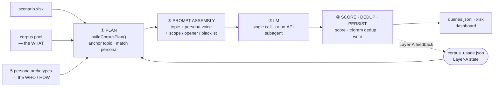

<div align="center">

# ui-queryMaker

### Realistic UI query data, synthesized with rigor.

Two orthogonal signals — **corpus** controls what to ask, **persona** controls who asks and how —
producing large, distribution-faithful natural-language UI query datasets.

[Live Demo](https://plevantem.github.io/queryMaker/) · [How to use](#how-to-use) · [No-API mode](#no-api-mode-recommended) · [Architecture](#architecture) · [Going deeper](#going-deeper)

[简体中文](./README.md) · **English**

[](#license)
[](https://nodejs.org/)
[](https://www.anthropic.com/)

</div>

---

## What is this

Most "let's just prompt an LLM for some queries" pipelines collapse into narrow,
templated data. This repo splits synthesis into two signals that **cannot be cleanly
covered by the same control channel**:

- **corpus — the WHAT**: every query is anchored to a real topic in the corpus pool, keeping the topic distribution faithful and collapse-free.
- **persona — the WHO / HOW**: 5 ordinary-user archetypes that fix the first-person viewpoint and voice.

Two pipelines combine the signals:

- **`corpus-direct` (production)** — both corpus and persona are **preset**: the topic is drawn from the pool, the persona is matched to the L2 scene by semantics, **one LLM call**.
- **`persona-driven` (research)** — the persona is **re-synthesized by an LLM every run**, then drives query generation (two calls).

| Corpus pool | ~8,100 topics / 135 L2 scenes (web + mobile) |
| --- | --- |
| Generation | `corpus-direct` single LLM call, **100%** topic-hit rate |
| API cost | **$0** — no-API mode via Claude Code subagents |
| Cross-batch dedup | Layer-A persisted usage state, samples least-used topics first |

## How to use

**Requirements**: Node ≥ 18. Clone the repo, then install dependencies:

```bash
npm install
```

#### Step 1 · Run offline (no API key needed)

Deterministic fallback mode — verifies your setup and shows what the output looks like:

```bash
npm run run:mvp
open data/reports_v2/dashboard.html   # open in a browser to see the distribution
```

#### Step 2 · Generate real data — `corpus-direct` (recommended for production)

```bash
node scripts/run-corpus.js --total 200
```

What it does: anchors 200 topics from the corpus pool, pairs each with a preset persona,
and emits a query in a single LLM call. Output lands in `data/output/corpus_run/`:
`queries.jsonl` + `queries.xlsx` + `summary.json`.

Common flags:

| Flag | Effect |
| --- | --- |
| `--total 500` | number of queries |
| `--platform web` \| `mobile` | target platform |
| `--exclude-l1 "深度研究"` | exclude L1 categories (substring match) |
| `--complexity-mix "vague,medium,medium"` | complexity ratio |
| `--prep-only` | skip the API, split into subagent batches (see next section) |

A real LLM needs credentials — see the `.env.local` template below, or just use the zero-cost **No-API mode**.

#### Step 3 (optional) · `persona-driven` free generation (research)

```bash
npm run run:free
```

Each query first has an LLM synthesize a persona, then generates the query — more voice
variety, but two calls and a slightly lower topic-hit rate.

> Full CLI commands and flags: [scripts/README.md](./scripts/README.md).

## No-API mode (recommended)

No API key required — use Claude Code's own subagents as the LLM, split generation into
batches processed in parallel, at zero external cost.

```bash
# 1. Split into batches (writes plan + placeholder queries + one prompt file per batch)
node scripts/run-corpus.js --total 500 --platform mobile --prep-only --out data/output/my_run

# 2. In Claude Code, spawn subagents — one per batch — to emit results directly

# 3. Merge back into queries.jsonl
node scripts/merge-subagent-retry.js \
  --in-dir data/output/my_run/_subagent_in --target-dir data/output/my_run
```

Translation (`prep-translate-batches.js` → subagents → `merge-haiku-translations.js`)
works the same way. The full web-1000 + mobile-500×N datasets were all produced at $0 this way.

<details>
<summary>Optional — connect a packy / OpenAI-compatible gateway via <code>.env.local</code></summary>

```bash
# OpenAI-compatible gateway
PACKY_API_KEY=your_api_key_here
PACKY_BASE_URL=https://www.packyapi.com/v1
PACKY_MODEL=claude-3-5-sonnet-20240620

# Anthropic / Claude Code style
ANTHROPIC_AUTH_TOKEN=your_cc_group_token_here
ANTHROPIC_BASE_URL=https://www.packyapi.com
ANTHROPIC_MODEL=claude-sonnet-4-6

# Concurrency / network
PACKY_CONCURRENCY=3
PACKY_TIMEOUT_MS=120000
PACKY_USE_SYSTEM_PROXY=1
```

</details>

## Core design

- **Dual-channel orthogonal control** — corpus anchors *what*, persona injects *who / how*; their Cartesian product maximizes coverage.
- **4-way ablation** — `llm-direct` / `corpus-direct` / `persona-direct` / `corpus+persona` on the same base model; `corpus-direct` is empirically Pareto-optimal.
- **Three diversification layers** — Layer-A cross-batch least-used dedup · opener hash for even distribution · persona-tone matched to the L2 scene.
- **Automatic corpus expansion** — capacity analysis (`analyze-corpus-capacity.js`) + a no-API subagent loop (`expand-corpus.js`) auto-refill topics per scene when a pool runs short.
- **Offline fallback** — runs deterministically with no LLM, suitable for smoke tests / CI.

## Architecture

The `corpus-direct` production pipeline: 4 steps, with successful rows fed back into the
Layer-A state so the next batch avoids already-used topics.



> The `persona-driven` pipeline adds one LLM call to synthesize the persona between
> steps 1 and 2; all other steps are shared.

- `scripts/` — CLI entry points (argument parsing, path conventions, file IO)
- `mvp/` — core pipeline logic (generation / scoring / design_style)
- `prompts/` — prompt assets
- `data/` — intermediate artifacts, output, SQLite, visual reports

## Going deeper

The README is just the entry point — deeper material lives in dedicated docs:

| Topic | Where |
| --- | --- |
| Full methodology, pipeline architecture, corpus consumption & expansion loop | [PAPER_PIPELINE_ARCHITECTURE.md](./PAPER_PIPELINE_ARCHITECTURE.md) |
| 4-way ablation comparison, evolution story (4-stage fixes) | [Live Demo](https://plevantem.github.io/queryMaker/) |
| All CLI commands and flags | [scripts/README.md](./scripts/README.md) |
| v2 pipeline data structures | [MVP_QUERY_FACTORY.md](./MVP_QUERY_FACTORY.md) |

## Limitations

- **The persona pool is a small set of 5 archetypes** — it covers the head of typical users; long-tail representativeness still needs validation against real logs.
- **Diversity is measured at the lexical and corpus-distribution layers** — deeper semantic / discriminator-layer evidence is out of scope here.
- **No end-to-end downstream validation** — the "model gain after training on synthetic data" question is unaddressed due to resource limits; integrators should run their own controlled comparison.

## License

[ISC](./LICENSE) © 2026 ui-queryMaker contributors

## Star History

<a href="https://www.star-history.com/?type=date&repos=PlevanTem%2FqueryMaker">
  <picture>
    <source media="(prefers-color-scheme: dark)" srcset="https://api.star-history.com/chart?repos=PlevanTem/queryMaker&type=date&theme=dark&legend=top-left" />
    
  </picture>
</a>

---

<div align="center">

**[Live Demo](https://plevantem.github.io/queryMaker/)** ·
**[简体中文](./README.md)** ·
**[Report a Bug](https://github.com/PlevanTem/queryMaker/issues)**

</div>
