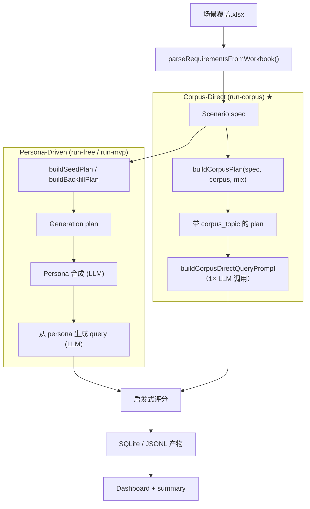
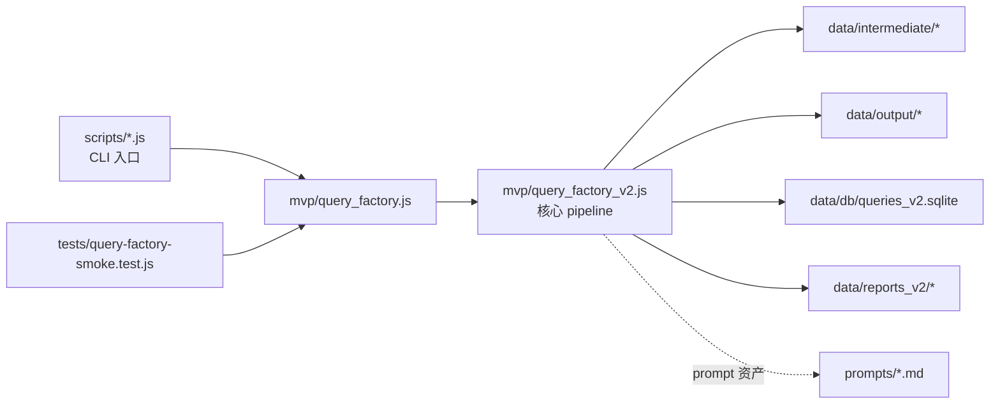

<div align="center">

# ui-queryMaker

### 真实可用的 UI Query 数据，以工程化方式合成。

一条生产级流水线，用于生成大规模、多样化、persona 真实可信的
自然语言 UI 需求 query —— **语料锚定 · 相似度验证 · 风格感知**。

[**在线 Demo**](https://plevantem.github.io/queryMaker/) ·
[快速开始](#快速开始) ·
[两条流水线](#两条流水线) ·
[四方法对比](#四方法对比) ·
[架构](#架构)

**简体中文** · [English](./README.en.md)

[](#license)
[](https://nodejs.org/)
[](https://www.anthropic.com/)
[](https://github.com/PlevanTem/queryMaker/stargazers)
[](https://github.com/PlevanTem/queryMaker/commits)

</div>

---

## 核心指标

| 指标 | 数值 | 说明 |
| --- | --- | --- |
| 语料覆盖 | **2,440 个 topic** | 61 个 L2 场景 · 12 个 L1 类目 |
| 跑通成功率 | **200 / 200** | `claude-sonnet-4-6`，0 失败 |
| 平均 query 长度 | **~84 词** | medium 复杂度，英文 |
| 单条 query 耗时 | **~3.3 秒** | 200 条约 11 分钟 |

> 在控制变量条件下对比了四种生成策略。人工评审认定
> **`corpus-direct` 为最高质量方案** —— topic 命中率 100%、模板痕迹最低、多样性最强。

## 为什么做这件事

绝大多数「随便 prompt 一下让 LLM 生成 query」的做法，最终都会塌缩成
窄分布、模板化、无法泛化的数据。本仓库从三个维度上解决这个问题：

| 没有它的样子 | 我们的做法 |
| --- | --- |
| **分布太窄** —— 100 条 query 都是 "build me a dashboard" 的变体，覆盖不到真实产品空间的 5% | **真实语料锚定** —— 每条生成都锁定到一个精选 2,440 entry 语料中的具体 topic |
| **机器味太重** —— LLM 默认输出礼貌、结构化、一致的语气，跟真实用户提需求的方式不一样 | **persona 驱动语气** —— 5 类 archetype × 3 档复杂度，产出以用户目标为锚的第一人称变化 |
| **视觉风格扁平** —— query 很少描述视觉风格，下游 UI 生成只能默认一种审美 | **设计风格感知** —— 11 个注册风格 × 3 种调用方式（默认 / 指定列表 / 启发式自动） |

## 项目亮点

- **端到端流水线** —— Excel 场景规格 → plan → 生成 → 评分 → SQLite → dashboard
- **两条生产链路并存** —— `corpus-direct`（单次调用、topic 锚定、生产推荐）和 `persona-driven`（两步调用、persona 锚定、研究/兼容）
- **离线 fallback 模式** —— 不接任何 LLM 也能跑通，`persona-fallback` 提供确定性输出，适合冒烟和 CI
- **多 transport 接入** —— `claude-cli`（子进程）/ `openai` 兼容 / `anthropic` `/v1/messages`，单参数切换
- **相似度去重** —— trigram 相似度算法保证 corpus 分布广度
- **可复跑、可断点续跑** —— 所有中间产物落盘；plan 是确定性的
- **内置基准测试** —— `test-corpus-methods.js` 控制变量跑四种策略，输出并排对比 HTML

## 快速开始

```bash
# 1. 安装依赖
npm install

# 2. 跑离线 MVP（不接 LLM，确定性 fallback）
npm run run:mvp

# 3. 查看结果
open data/reports_v2/dashboard.html
```

**接真实 LLM** —— 把凭证写入 `.env.local`，然后选择一条流水线：

```bash
# Corpus-Direct（生产推荐）
node scripts/run-corpus.js --total 200

# Persona-Driven 自由生成（研究 / 探索）
npm run run:free
```

<details>
<summary><b>完整 .env.local 模板</b></summary>

```bash
# OpenAI 兼容网关（Packy / LiteLLM / 自建）
PACKY_API_KEY=your_api_key_here
PACKY_BASE_URL=https://www.packyapi.com/v1
PACKY_MODEL=claude-3-5-sonnet-20240620

# Anthropic / Claude Code 风格（CC 分组令牌）
ANTHROPIC_AUTH_TOKEN=your_cc_group_token_here
ANTHROPIC_BASE_URL=https://www.packyapi.com
ANTHROPIC_MODEL=claude-sonnet-4-6

# 并发 / 网络
PACKY_CONCURRENCY=3
PACKY_TIMEOUT_MS=120000
PACKY_MAX_RETRIES=2
PACKY_USE_SYSTEM_PROXY=1
PACKY_ALLOW_INSECURE_TLS=0
```

说明：
- `llm-openai` / `real-llm` / `packy-openai` → OpenAI 兼容接口
- `llm-anthropic` / `claude-code` / `anthropic-cc` / `packy-cc` → Anthropic 风格 `/v1/messages`
- LLM 调用使用 Node 内建 `undici`，无需额外安装 SDK
- Windows 默认自动读取系统代理，内网网关可设置 `PACKY_USE_SYSTEM_PROXY=0`

</details>

## 两条流水线

仓库提供两条生产路径，共用评分、去重和报告层：

| | Corpus-Direct ★ | Persona-Driven |
| --- | --- | --- |
| 入口 | `node scripts/run-corpus.js` | `npm run run:free` |
| 单 task LLM 调用次数 | **1** | 2（persona → query） |
| 锚点 | 真实语料中的具体 topic（2,440 条） | 合成 persona + 场景 |
| Topic 命中率 | **100%** | ~70–85%（会在 L2 类目内漂移） |
| 适用场景 | 生产数据集、分布忠实的语料 | 研究、语气多样性探索 |



## 四方法对比

`scripts/test-corpus-methods.js` 在控制变量下跑四种策略，并产出并排对比报告。主要结论：

| 方法 | Topic 命中 | 平均长度 | 模板痕迹 | 备注 |
| --- | --- | --- | --- | --- |
| **`corpus-direct`** ★ | **100%** | 84 词 | 极低 | 生产首选。锁 topic、显式控制 complexity |
| `scene-direct` | ~75% | 71 词 | 中 | 在 L2 类目里漂移，省一跳 |
| `persona-only` | ~70% | 92 词 | 低 | 语气最强，topic 纪律最弱 |
| `persona+corpus` | ~95% | 96 词 | 低 | 成本最高，相比 `corpus-direct` 边际收益小 |

完整对比写作和数据见 [在线 Demo](https://plevantem.github.io/queryMaker/)，
或在本地跑完 `scripts/test-corpus-methods.js` 后打开 `data/output/corpus_method_comparison.html`。

## 架构

核心逻辑集中，CLI 是薄封装。



- `scripts/` —— 阶段化 CLI 入口（参数解析、路径约定、文件 IO）
- `mvp/` —— 所有可运行核心逻辑
- `prompts/` —— prompt 资产（persona 链路 + 研究版多阶段）
- `data/` —— 中间产物、输出、SQLite、可视化报表
- `tests/` —— 主链路冒烟测试
- `ARCHIVE/` —— 方法论与研究蓝图（不等于代码全部已实现）

## 设计风格系统

`design_style` 默认为 `null` —— LLM 根据上下文自然推断视觉方向。
三种 opt-in 模式：

| 方式 | 行为 |
| --- | --- |
| 不传（默认） | `design_style: null`，LLM 按场景上下文推断 |
| `--design-styles "Dark,Glassmorphism,Cyberpunk"` | 在指定列表中轮换分配 |
| `--design-styles auto` | 按 L1/L2/app 关键词启发式推断 |

内置 11 个注册风格：`Dark`、`Glassmorphism`、`Neumorphism`、`Neubrutalism`、`Minimalism`、
`Material`、`Data-Dense`、`Cyberpunk`、`Luxury`、`Vibrant`。通过 `registerDesignStyle()`
可扩展，注册时同步更新 `DESIGN_STYLES` 列表、中文 persona hint 和英文 prompt 指令。

<details>
<summary><b>项目结构</b></summary>

```text
.
├── README.md / README.en.md
├── MVP_QUERY_FACTORY.md
├── docs/index.html                    # ★ 公开 landing page (GitHub Pages)
├── package.json
├── mvp/
│   ├── query_factory.js
│   └── query_factory_v2.js            # 核心：pipeline / 评分 / design_style
├── scripts/
│   ├── README.md                      # CLI 参数 / 示例 / 设计原则
│   ├── lib/
│   │   ├── llm-batch.js               # transports / 重试 / persona pipeline / 并发池
│   │   └── claude-cli.js              # ★ claude CLI 子进程（绕过 CC 网关 UA 校验）
│   ├── corpus_data.json               # ★ 61 个 L2 × ~40 topics
│   ├── build_corpus.py                # corpus 构建脚本
│   ├── gen_html.py                    # corpus 可视化
│   ├── run-corpus.js                  # ★ Corpus-Direct 一键流水线（生产）
│   ├── test-corpus-methods.js         # 4 方法对比评测
│   ├── run-free.js                    # ★ LLM 自由生成一键流水线
│   ├── batch-generate-queries.js      # LLM 批量生成（run-free 内部调用）
│   ├── build-free200-plan.js          # ★ 自由生成 plan（200 条，persona-scope 控制）
│   ├── build-expand200-plan.js        # 发散拓展 plan（200 条，3 part 结构）
│   ├── generate-analysis-report.js    # ★ 批次质量分析 HTML（含 persona 卡片）
│   ├── score-queries.js
│   ├── export-queries-csv.js          # ★ 导出带前缀的 query CSV
│   ├── build-query-comparison.js
│   ├── generate-extra-scenes.js       # 基于 L1 扩展 L2 场景（41 个新）
│   ├── test-api-connectivity.js
│   ├── parse-requirements.js
│   ├── build-generation-plan.js
│   ├── build-backfill-plan.js
│   ├── generate-queries.js
│   ├── supplement-anchored-persona-queries.js
│   ├── import-queries.js
│   ├── build-dashboard.js
│   ├── preview-persona-flow.js
│   ├── run-mvp.js                     # 旧版一键（persona-fallback，无 LLM）
│   └── legacy/                        # 已归档一次性脚本
├── prompts/
│   ├── persona_synthesis_prompt.md
│   ├── query_from_persona_prompt.md
│   └── generate_corpus_prompt.md
├── ARCHIVE/                           # 研究版方法论 (p1-p5)
├── tests/
│   └── query-factory-smoke.test.js
└── data/
    ├── intermediate/
    ├── output/
    │   ├── corpus_run/                # ★ Corpus-Direct 输出
    │   ├── corpus_method_comparison.html
    │   └── runs/
    │       ├── expand200_llm/
    │       └── free200_llm/           # ★ 自由生成批次输出
    ├── db/
    └── reports_v2/
```

</details>

<details>
<summary><b>CLI 命令清单</b></summary>

| 命令 | 用途 |
| --- | --- |
| `npm run parse:requirements` | 解析 Excel → 标准化场景规格 |
| `npm run plan:seed` | 生成首轮 seed plan |
| `npm run plan:backfill` | 对覆盖不足的场景生成补齐 plan |
| `npm run generate:queries` | 根据 plan 生成 query |
| `npm run preview:persona` | 预览单条任务的 persona + query 生成 |
| `npm run score:queries` | 启发式质量评分 |
| `npm run import:queries` | 将场景与 query 导入 SQLite |
| `npm run build:dashboard` | 从 SQLite 生成静态 dashboard |
| `npm run run:mvp` | 旧版一键流水线（persona-fallback，无 LLM） |
| `npm run run:free` | ★ LLM 自由生成一键流水线（persona-driven） |
| `node scripts/run-corpus.js` | ★ Corpus-Direct 一键流水线（生产） |
| `npm run batch:generate` | LLM 批量生成单步入口（支持断点续跑） |
| `npm run build:comparison` | 多 run 横向对比 HTML |
| `npm run test:api` | 探活：Anthropic 与 OpenAI 兼容端点 |
| `npm test` | 冒烟测试 |

**直接调用脚本：**

```bash
# Corpus-Direct
node scripts/run-corpus.js --total 200 --complexity-mix "vague,medium,medium"
node scripts/run-corpus.js --total 200 --dry-run                          # 只验证 plan
node scripts/run-corpus.js --total 200 --limit 10                          # 小批量真实跑

# 自由生成
node scripts/run-free.js --output-dir data/output/runs/free200_v2 --no-resume --export-csv

# Plan 构建
node scripts/build-free200-plan.js [--persona-scope scene|task]
node scripts/build-expand200-plan.js [--design-styles "Dark,Glassmorphism"]

# 分析报告
node scripts/generate-analysis-report.js \
  --input  data/output/runs/<batch>/scored_queries.jsonl \
  --output data/output/runs/<batch>/analysis_report.html
```

</details>

## 评分规则

`scoreQueryRecord()` 按复杂度独立打分：

- **`vague`** —— 词数 5–40、含 app 类型词、无尾问句、无 sign-off
- **`medium` / `complex`** —— UI 组件词汇、句子结构、复杂度对齐
- **加权公式** —— `Authenticity × 0.4 + Specificity × 0.4 + Diversity × 0.2`，通过阈值 ≥ 2.8
- **`design_style` 影响** —— 字段有值时 Diversity 维度 +1；`null` 时 Diversity 最高 4 分

## Roadmap

- [ ] LLM-based 质量评分（用 `p5` 设计替换启发式）
- [ ] 端到端研究版流水线（Stage 1 → Stage 4 全自动）
- [ ] 分布感知的 backfill（从按场景补齐升级为按热区补齐）
- [ ] 在线服务化 / 定时批处理
- [ ] 训练集规模去重（当前是 trigram、批次级别）

## 当前状态

**已实现**

- Excel → scenario spec 解析
- seed + backfill plan 生成（同组任务共享 persona）
- Persona-driven 离线 fallback 生成
- LLM 两步生成，三种 transport（`claude-cli` / `openai` / `anthropic`）
- Corpus-Direct 生产流水线（单次调用、topic 锚定）
- 4 方法控制变量基准评测
- 启发式评分（按复杂度独立、design-style 感知）
- 设计风格系统（11 种、3 种调用方式、动态注册）
- 可复用质量分析报告 skill（交互式 HTML + persona 卡片）
- 自由生成流水线（`run-free`、persona-scope 控制）
- 带前缀 CSV 导出
- SQLite 导入 + 静态 dashboard
- 主链路冒烟测试

**尚未端到端打通**

- 基于 `p5` 的 LLM 评分
- Stage 1 → Stage 4 全自动
- 在线服务 / 任务调度

## 贡献指南

欢迎 PR。起步路径：

1. `npm install && npm test` —— 冒烟测试要全绿
2. 翻一遍 [`scripts/README.md`](./scripts/README.md) 了解 CLI 设计契约
3. 较大重构请先开 issue 讨论

## Star History

<a href="https://star-history.com/#PlevanTem/queryMaker&Date">
  <picture>
    <source media="(prefers-color-scheme: dark)" srcset="https://api.star-history.com/svg?repos=PlevanTem/queryMaker&type=Date&theme=dark" />
    <source media="(prefers-color-scheme: light)" srcset="https://api.star-history.com/svg?repos=PlevanTem/queryMaker&type=Date" />
    
  </picture>
</a>

## License

[ISC](./LICENSE) © 2026 ui-queryMaker contributors

---

<div align="center">

**[在线 Demo](https://plevantem.github.io/queryMaker/)** ·
**[English](./README.en.md)** ·
**[报告 Bug](https://github.com/PlevanTem/queryMaker/issues)**

</div>
