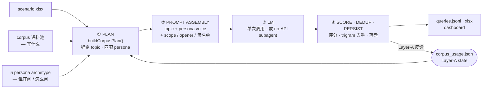

<div align="center">

# ui-queryMaker

### 工程化合成真实、多样、persona 可信的 UI 需求 query

Query Instruction 是数据管线的初始阶段，决定了整个数据管线下游的任务分布，由此管线需要制定科学的“教学大纲与考题”，因为这高度影响了学生未来能解决什么范围的问题。

当前许多数据集gap在：
- 大纲不全（缺失有效适用模型提升 "前端设计能力"场景覆盖多样性的能力）
- 教材散乱（数据集要么太简单，要么像个PRD，复杂度没有被很好模块化控制）
- 不够真实（没法客观反应人机交互的指令习惯，影响模型在真实场景的使用体验）

通过调研参考了一系列论文，本项目
把 query 合成拆成两组正交信号 —— **corpus** 控制写什么、**persona** 控制谁在问怎么问 ——
产出大规模、分布忠实的自然语言 UI query 数据集。

[在线 Demo](https://plevantem.github.io/queryMaker/) · [如何使用](#如何使用) · [No-API 模式](#no-api-模式推荐) · [架构](#架构) · [深入了解](#深入了解)

简体中文 · [English](./README.en.md)

[](#license)
[](https://nodejs.org/)
[](https://www.anthropic.com/)

</div>

---

## 这是什么

绝大多数「随便 prompt 一下让 LLM 生成 query」的做法，最终都会塌缩成窄分布、模板化的数据。
本仓库把合成拆成两组**不能用同一个信号干净覆盖**的正交信号：

- **corpus —— 写什么**：每条 query 锚定到语料池里一个真实 topic，保证主题分布忠实、不塌缩。
- **persona —— 谁在问、怎么问**：5 类普通用户 archetype，决定第一人称视角与语气。

两组信号有两条链路把它们组合起来：

- **`corpus-direct`（生产推荐）** —— corpus 与 persona **都预置注入**：topic 从语料池取、persona 按 L2 语义静态匹配 archetype，**单次 LLM 调用**。
- **`persona-driven`（研究探索）** —— persona **每次由 LLM 重新合成**，再由 persona 生成 query（两步调用）。

| 语料池 | ~8,100 个 topic / 135 个 L2 场景（web + mobile）|
| --- | --- |
| 生成方式 | `corpus-direct` 单次 LLM 调用，topic 命中率 **100%** |
| API 成本 | **$0** —— no-API 模式走 Claude Code subagent |
| 跨批次去重 | Layer-A 持久化 usage state，优先采样最少使用的 topic |

## 如何使用

**环境要求**：Node ≥ 18。克隆仓库后安装依赖：

```bash
npm install
```

#### 第一步 · 离线跑通（无需任何 API key）

确定性 fallback 模式 —— 用来验证环境、并看清产物长什么样：

```bash
npm run run:mvp
open data/reports_v2/dashboard.html   # 浏览器打开看分布
```

#### 第二步 · 生成真实数据 —— `corpus-direct`（生产推荐）

```bash
node scripts/run-corpus.js --total 200
```

做了什么：从语料池锚定 200 个 topic，每个 topic 配一个预置 persona，单次 LLM 调用直出 query。
产物落在 `data/output/corpus_run/`：`queries.jsonl` + `queries.xlsx` + `summary.json`。

常用参数：

| 参数 | 作用 |
| --- | --- |
| `--total 500` | 生成条数 |
| `--platform web` \| `mobile` | 目标平台 |
| `--exclude-l1 "深度研究"` | 排除某些 L1 类目（子串匹配） |
| `--complexity-mix "vague,medium,medium"` | 复杂度配比 |
| `--prep-only` | 不调 API，拆成 subagent batch（见下节） |

接真实 LLM 需要凭证 —— 见下方 `.env.local` 模板；或直接用零成本的 **No-API 模式**。

#### 第三步（可选）· `persona-driven` 自由生成（研究用）

```bash
npm run run:free
```

每条 query 先用 LLM 合成一个 persona，再生成 query —— 语气更多样，但两次调用、topic 命中率略低。

> CLI 全部命令与参数见 [scripts/README.md](./scripts/README.md)。

## No-API 模式（推荐）

没有 API key 也能跑 —— 用 Claude Code 自身的 subagent 当 LLM，把生成拆成 batch 并行处理，零外部成本。

```bash
# 1. 拆 batch（写出 plan + 占位 queries + 每个 batch 的 prompt 文件）
node scripts/run-corpus.js --total 500 --platform mobile --prep-only --out data/output/my_run

# 2. 在 Claude Code 里 spawn subagent，每个吃一个 batch，直出结果

# 3. 合并回 queries.jsonl
node scripts/merge-subagent-retry.js \
  --in-dir data/output/my_run/_subagent_in --target-dir data/output/my_run
```

翻译（`prep-translate-batches.js` → subagent → `merge-haiku-translations.js`）同理。
web 1000 + mobile 500×N 整套数据集都是这么 0 成本产出的。

<details>
<summary>接 packy / OpenAI 兼容网关（可选）—— <code>.env.local</code> 模板</summary>

```bash
# OpenAI 兼容网关
PACKY_API_KEY=your_api_key_here
PACKY_BASE_URL=https://www.packyapi.com/v1
PACKY_MODEL=claude-3-5-sonnet-20240620

# Anthropic / Claude Code 风格
ANTHROPIC_AUTH_TOKEN=your_cc_group_token_here
ANTHROPIC_BASE_URL=https://www.packyapi.com
ANTHROPIC_MODEL=claude-sonnet-4-6

# 并发 / 网络
PACKY_CONCURRENCY=3
PACKY_TIMEOUT_MS=120000
PACKY_USE_SYSTEM_PROXY=1
```

</details>

## 核心设计

- **双通道正交控制** —— corpus 锚定 *what*、persona 注入 *who / how*，笛卡尔积式最大化覆盖空间。
- **4 档 ablation 验证** —— `llm-direct` / `corpus-direct` / `persona-direct` / `corpus+persona` 同基座对照，实证 `corpus-direct` 取得帕累托最优。
- **三层差异化** —— Layer-A 跨批次最少使用去重 · opener 哈希均布 · persona-tone 按 L2 语义匹配。
- **语料池自动扩容** —— 容量分析（`analyze-corpus-capacity.js`）+ no-API subagent 回路（`expand-corpus.js`），池子不够时按场景自动补 topic。
- **离线 fallback** —— 无 LLM 也能确定性跑通，适合冒烟 / CI。

## 架构

`corpus-direct` 生产链路：4 个 step，成功条目反馈回 Layer-A state 让下一批避开已用 topic。



> `persona-driven` 链路在 step 1 与 step 2 之间多一次 LLM 调用合成 persona，其余 step 共用。

- `scripts/` —— CLI 入口（参数解析、路径约定、文件 IO）
- `mvp/` —— 核心 pipeline 逻辑（生成 / 评分 / design_style）
- `prompts/` —— prompt 资产
- `data/` —— 中间产物、输出、SQLite、可视化报表

## 深入了解

README 只讲入口，深入内容拆到专门文档：

| 想了解 | 去哪看 |
| --- | --- |
| 完整方法论、流水线架构、语料消耗与扩容闭环 | [PAPER_PIPELINE_ARCHITECTURE.md](./PAPER_PIPELINE_ARCHITECTURE.md) |
| 4 方法 ablation 对比、演进故事（4 阶段修复） | [在线 Demo](https://plevantem.github.io/queryMaker/) |
| CLI 全部命令与参数 | [scripts/README.md](./scripts/README.md) |
| v2 流水线数据结构 | [MVP_QUERY_FACTORY.md](./MVP_QUERY_FACTORY.md) |

## 局限与已知边界

- **persona 池是 5 类 archetype 的小集合** —— 覆盖头部典型用户，长尾类型的代表性待真实日志反向验证。
- **多样性目前测到 lexical 层与 corpus 分布层** —— semantic / 判别器层的更深证据本仓库未覆盖。
- **端到端下游验证未做** —— 「合成数据进训练后的模型增益」受资源限制未覆盖，建议接入方自行受控对比。

## License

[ISC](./LICENSE) © 2026 ui-queryMaker contributors

## Star History

<a href="https://www.star-history.com/?type=date&repos=PlevanTem%2FqueryMaker">
  <picture>
    <source media="(prefers-color-scheme: dark)" srcset="https://api.star-history.com/chart?repos=PlevanTem/queryMaker&type=date&theme=dark&legend=top-left" />
    
  </picture>
</a>

---

<div align="center">

**[在线 Demo](https://plevantem.github.io/queryMaker/)** ·
**[English](./README.en.md)** ·
**[报告 Bug](https://github.com/PlevanTem/queryMaker/issues)**

</div>
