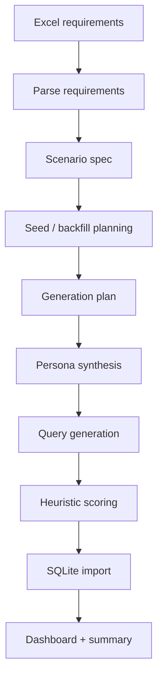
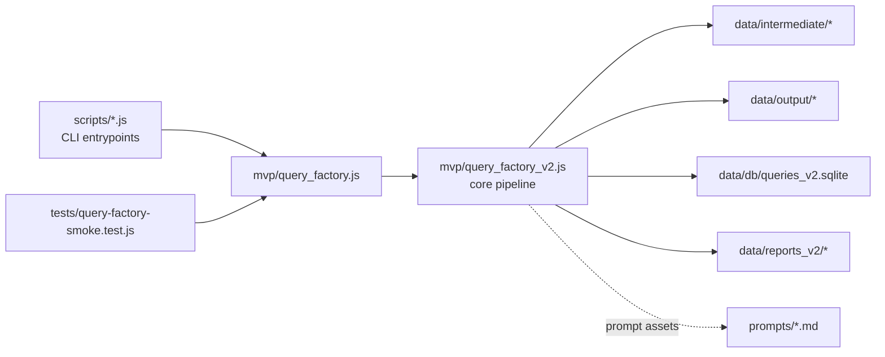
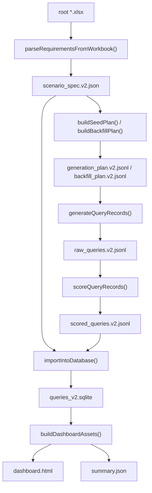
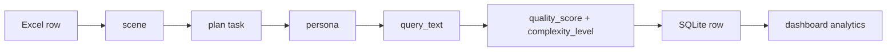

# UI QueryMaker Pipeline

> Build realistic, diverse, and structured front-end UI requirement queries from scenario specifications.

一个面向前端 UI 需求数据集构建的生成流水线。
它将需求表格解析为场景，自动生成 `persona-driven query`，完成评分、入库与可视化，形成一条可离线跑通的 MVP 数据生产链路。

## Why This Project

当前很多 UI 生成或代码生成相关数据，往往有三个问题：

- 只有“页面长什么样”，没有“用户为什么会提这个需求”
- 只有功能描述，缺少产品语境、角色差异与表达风格
- 只有样例，没有一条可以稳定复跑、统计分析、持续扩展的数据生产流水线

这个项目的目标不是再造一个 prompt 集合，而是把这件事做成一个 **可解析、可生成、可评分、可入库、可分析** 的系统。

当前已落地的 v2 主链路：

```text
xlsx requirements -> scenario spec -> generation plan -> persona/query generation -> scoring -> SQLite -> dashboard
```

## Pain Points In Query / Instruction Synthesis

在 UI query / instruction 合成这件事上，常见痛点不是“模型不会写句子”，而是生成结果很难长期稳定地作为数据资产使用。

典型问题有：

- `模板味太重`
直接把场景字段拼成一句话，容易得到表面多样、实际同质的 instruction
- `只有功能，没有人`
很多 query 只有模块和功能，没有真实用户动机、表达方式和信息缺失模式
- `场景原文污染输出`
像 `① 个人生活类（旅行回忆、年度相册、画作展示、宝宝成长）` 这样的原始需求文本，如果直接带进 query，会让数据既生硬又泄漏标注痕迹
- `复杂度不可控`
生成前没有显式控制，生成后也无法判断到底是 vague、medium 还是 complex
- `只能生成，不能运营`
没有 plan、数据库、统计和可视化时，数据很难补齐、复跑、对比和持续迭代

我们的解决方案是把 query 合成从“单步 prompt 生成”改造成“结构化数据生产链路”，靠 前置规划 + 显式维度建模 + 生成后可观测回判，控制“分布多样性”和“低重复性”：

- `场景先清洗，再进入生成`
先把 `l2_scene_raw` 拆成 `l2_scene_label`、`l2_scene_examples` 和 `application_type_candidates`，避免把原始 Excel 文本直接污染最终 instruction
- `显式引入 L3 application_type`
让 query 不是围着抽象场景说空话，而是围绕更具体的 app/product direction 生成
- `persona-driven synthesis`
不再直接从字段拼 query，而是先合成 persona，再由 persona 生成 instruction，把“谁在提需求、为什么这样提”显式建模出来
- `target_complexity 前置控制`
在 plan 阶段就指定 `vague / medium / complex`，而不是等生成完再事后猜测
- `生成后再做回判`
保留 `complexity_level` 和 `quality_score`，用于判断“计划中的复杂度”是否真的落到了输出上
- `把生成变成可运营系统`
中间产物全部落盘，最终入 SQLite 并进入 dashboard，这样 query 数据不只是一次性样例，而是可以复跑、补齐、分析和持续优化的数据集

## Highlights

- `End-to-end pipeline`
从 Excel 输入一路到 SQLite 和静态 Dashboard，完整闭环
- `Persona-driven generation`
不直接拼模板字段，而是先构造 persona，再生成 query
- `Deterministic fallback`
即使不接外部 LLM，当前版本也可以离线稳定产出结果
- `Structured artifacts`
中间结果全部显式落盘，便于排查、复用和二次分析
- `MVP + research blueprint`
一边有当前可运行实现，一边保留完整研究版方法论与提示词资产

## Quick Start

### 1. 安装依赖

```bash
npm install
```

### 2. 准备输入

将需求 Excel 放到仓库根目录，或在运行时通过 `--input` 指定。

### 3. 一键跑通主链路

```bash
npm run run:mvp
```

### 4. 查看结果

- 结构化场景：`data/intermediate/scenario_spec.v2.json`
- 生成计划：`data/intermediate/generation_plan.v2.jsonl`
- 原始 query：`data/output/raw_queries.v2.jsonl`
- 评分结果：`data/output/scored_queries.v2.jsonl`
- 数据库：`data/db/queries_v2.sqlite`
- 可视化报表：`data/reports_v2/dashboard.html`

### 5. 运行验证

```bash
npm test
```

### 6. 使用真实 LLM 生成

当前仓库除离线 `persona-fallback` 外，也支持通过 OpenAI 兼容接口和 Anthropic / Claude Code 风格接口接入真实模型。

推荐使用 `.env.local` 配置：

```bash
PACKY_API_KEY=your_api_key_here
PACKY_BASE_URL=https://www.packyapi.com/v1
PACKY_MODEL=claude-3-5-sonnet-20240620
ANTHROPIC_AUTH_TOKEN=your_cc_group_token_here
ANTHROPIC_BASE_URL=https://www.packyapi.com
ANTHROPIC_MODEL=claude-sonnet-4-6
PACKY_CONCURRENCY=3
PACKY_TIMEOUT_MS=120000
PACKY_MAX_RETRIES=2
PACKY_USE_SYSTEM_PROXY=1
PACKY_ALLOW_INSECURE_TLS=0
```

然后可直接运行：

```bash
npm run generate:queries -- --mode llm-openai
```

如果你使用的是 `CC` 分组令牌，可改走 Anthropic / Claude Code 风格接口：

```bash
npm run generate:queries -- --mode llm-anthropic
```

或一键跑完整链路：

```bash
npm run run:mvp -- --mode llm-openai
```

```bash
npm run run:mvp -- --mode llm-anthropic
```

说明：

- `llm-openai` / `real-llm` / `packy-openai` 都会走真实模型调用
- `llm-anthropic` / `claude-code` / `anthropic-cc` / `packy-cc` 会走 Anthropic / Claude Code 风格的 `/v1/messages`
- 真实调用会先生成 persona，再基于 persona 生成 query
- `PACKY_BASE_URL` 为 OpenAI 兼容的 Chat Completions 基地址，通常以 `/v1` 结尾；接入自建或 LiteLLM 网关时设置为你提供的 POST 根路径即可；`PACKY_MODEL` 必须与该网关 `GET /v1/models` 返回的 `id` 一致（例如 `gemini-3.1-pro-preview`）
- 单条联调可运行：`npm run preview:persona -- --mode llm-openai --index 0`
- 若未配置 API Key，会自动报错并提示需要设置 `PACKY_API_KEY` 或 `OPENAI_API_KEY`
- 若使用 `CC` 分组，优先设置 `ANTHROPIC_AUTH_TOKEN` 和 `ANTHROPIC_BASE_URL`
- Windows 下默认会尝试读取系统代理设置，并将其映射到 `HTTP_PROXY / HTTPS_PROXY`；内网直连网关时可在 `.env.local` 中设置 `PACKY_USE_SYSTEM_PROXY=0`
- 若公司代理做了 HTTPS 中间证书注入，Node 可能报 `SELF_SIGNED_CERT_IN_CHAIN`
- 这时优先建议给 Node 配置可信 CA；临时验证时也可将 `PACKY_ALLOW_INSECURE_TLS=1`

**依赖说明：** LLM 调用使用项目已有的 `undici`（Node 内建环境变量加载见 `mvp/query_factory_v2.js`），接入真实模型时 **无需** 额外安装 OpenAI 官方 SDK；`npm install` 一次即可，除非升级 Node 大版本，一般不必为「换模型 / 换网关」更新 `package.json` 依赖。

### 7. 真实 LLM 批量生成（推荐入口）

`batch:generate` 是当前推荐的批量生成入口，它内置：xlsx 抽样 / 外部 plan / 三种 transport（含本机 `claude-cli` 子进程，绕过 packy-cc 网关指纹检测）/ 退避重试 / 断点续跑 / 标准化产物。详细参数见 [scripts/README.md](./scripts/README.md)。

#### 快速启动

```bash
# 抽 5 个二级场景做一次冒烟
node scripts/batch-generate-queries.js \
  --input data/input/场景覆盖.xlsx \
  --output-dir data/output/runs/sample5 \
  --sample-n 5 --seed 4073
```

或用项目已有的 plan 跑全量：

```bash
node scripts/batch-generate-queries.js \
  --plan data/intermediate/generation_plan.v2.jsonl \
  --output-dir data/output/runs/full \
  --concurrency 4
```

#### 前置条件

- `.env.local` 配好 `PACKY_API_KEY` 和 `ANTHROPIC_BASE_URL`
- 本机已安装 Claude Code CLI：`npm i -g @anthropic-ai/claude-code`（默认 `claude-cli` transport 依赖）

#### 它会做什么（以抽样 5 个场景为例）

| 步骤 | 行为 |
|---|---|
| 1. 加载 env | 读取 `.env.local`，把 `PACKY_API_KEY` 同步到 `ANTHROPIC_API_KEY / ANTHROPIC_AUTH_TOKEN` |
| 2. 解析 + 抽样 | `parseRequirementsFromWorkbook` 解析 xlsx → 全部场景 → 用 seed 确定性随机抽 5 个二级场景 |
| 3. 构建 plan | `buildSeedPlan` 把每个场景展开成 vague / medium / complex 三档 → **15 个任务** |
| 4. resume 检查 | 默认开。若 `--output-dir/raw_queries.jsonl` 已存在，跳过已完成的 `query_id` |
| 5. 起 LLM | 默认 `claude-cli` transport（spawn `claude.cmd -p --bare …` 子进程，绕过 packy-cc 网关指纹检测） |
| 6. 双步 pipeline | 每个任务串行两次 LLM 调用：① persona JSON 合成（带 retry）② 用 persona 生成 query 文本（带 retry） |
| 7. 并发池 | 默认 3 并发（`--concurrency`），按 503/超时/CLI 非零退出码 退避重试 2 次（`--max-retries`） |
| 8. 流式落盘 | 每条成功立即 append 到 `raw_queries.jsonl`，崩了重跑同目录靠 resume 续上 |
| 9. 收尾 | 按 plan 顺序重写 jsonl + 写 `stats.json` / `errors.json` / `config.json` |

#### 输出（`--output-dir` 下）

```
plan.json          本批 plan 快照
raw_queries.jsonl  ★ 主产物：每行一条 query 记录（与 raw_queries.v2.jsonl schema 兼容）
errors.json        失败明细（仅在有失败时写）
stats.json         按复杂度的字数 / persona 解析率 / 耗时
config.json        入参/transport 留痕（API key 已脱敏）
```

#### 时间预估

- 单条任务约 30–60s（persona 20–40s + query 10–20s）
- 抽样 5 场景 = 15 任务，并发 3：**约 3–5 分钟**
- 全量 ~280 任务，并发 4：**约 30–40 分钟**

#### 跑完后看效果

`build:comparison` 把任意多个 run 拼成并排 HTML（自动计算跨复杂度区分度并标出最优组）：

```bash
# 单 run 看自己
node scripts/build-query-comparison.js \
  --run-dir data/output/runs/sample5 \
  --output  data/output/sample5_report.html

# 多 run 横评（如 baseline vs few-shot）
node scripts/build-query-comparison.js \
  --run-dir data/output/runs/sample5_baseline \
  --run-dir data/output/runs/sample5_fewshot \
  --output  data/output/query_comparison.html
```

## Pipeline Overview




## Architecture

当前代码结构非常明确，核心逻辑集中，CLI 只是薄封装。




### Core Design

- `scripts/`
阶段化 CLI 入口，负责参数解析、路径约定和文件落盘
- `mvp/`
当前可运行实现，所有核心逻辑都在这里
- `prompts/`
prompt 资产层，既包含当前 persona 链路提示词，也包含研究版多阶段方案
- `data/`
中间文件、输出文件、数据库和可视化报表
- `tests/`
冒烟测试，确保主链路可跑通
- `ARCHIVE/`
方法论与研究设计背景，不等于当前所有代码都已实现

## Data Flow

### Runtime Data Flow




### Record Lifecycle




## Project Layout

```text
.
├── README.md
├── MVP_QUERY_FACTORY.md
├── package.json
├── mvp/
│   ├── query_factory.js
│   └── query_factory_v2.js
├── scripts/
│   ├── README.md                       # batch / comparison 脚本使用说明
│   ├── lib/
│   │   └── llm-batch.js                # 共享：transports / 重试 / pipeline / pool / stats
│   ├── batch-generate-queries.js       # 真实 LLM 批量生成入口（推荐）
│   ├── build-query-comparison.js       # 多 run 对比 HTML 生成器
│   ├── test-api-connectivity.js        # API 网关探活
│   ├── parse-requirements.js
│   ├── build-generation-plan.js
│   ├── build-backfill-plan.js
│   ├── generate-queries.js
│   ├── batch-generate-queries.js
│   ├── supplement-anchored-persona-queries.js
│   ├── score-queries.js
│   ├── import-queries.js
│   ├── build-dashboard.js
│   ├── preview-persona-flow.js
│   ├── run-mvp.js
│   ├── lib/
│   │   └── llm-batch.js
│   └── legacy/                         # 已归档的一次性脚本
├── prompts/
│   ├── persona_synthesis_prompt.md
│   ├── query_from_persona_prompt.md
│   ├── p1_industry_generation.md
│   ├── p2_product_derivation.md
│   ├── p3_social_extraction.md
│   ├── p4_persona_query_gen.md
│   └── p5_quality_scoring.md
├── tests/
│   └── query-factory-smoke.test.js
├── data/
│   ├── intermediate/
│   ├── output/
│   ├── db/
│   └── reports_v2/
└── ARCHIVE/
    └── README.md
```

## CLI Commands


| Command                      | Purpose                      |
| ---------------------------- | ---------------------------- |
| `npm run parse:requirements` | 解析 Excel，输出标准化场景定义           |
| `npm run plan:seed`          | 生成首轮 seed plan               |
| `npm run plan:backfill`      | 对覆盖不足的场景生成补齐计划               |
| `npm run generate:queries`   | 根据 plan 生成 query             |
| `npm run preview:persona`    | 预览单条任务的 persona 与 query 生成过程 |
| `npm run score:queries`      | 对 query 做启发式评分               |
| `npm run import:queries`     | 将场景与 query 导入 SQLite         |
| `npm run build:dashboard`    | 从数据库生成静态报表                   |
| `npm run run:mvp`            | 一键跑通完整 v2 MVP 流程             |
| `npm run batch:generate`     | 真实 LLM 批量生成 query（支持 xlsx 抽样 / plan 输入 / 断点续跑） |
| `npm run build:comparison`   | 把任意多个 batch run 拼成并排 HTML 对比报告 |
| `npm run test:api`           | 探活：分别测 Anthropic 与 OpenAI 兼容端点 |
| `npm test`                   | 运行冒烟测试                       |


## Key Artifacts


| Path                                         | Description       |
| -------------------------------------------- | ----------------- |
| `data/intermediate/scenario_spec.v2.json`    | 清洗后的场景规范          |
| `data/intermediate/generation_plan.v2.jsonl` | 首轮生成任务列表          |
| `data/intermediate/backfill_plan.v2.jsonl`   | 覆盖补齐任务列表          |
| `data/output/raw_queries.v2.jsonl`           | 生成后的原始 query      |
| `data/output/scored_queries.v2.jsonl`        | 带质量分和复杂度标签的 query |
| `data/db/queries_v2.sqlite`                  | 最终分析数据库           |
| `data/reports_v2/dashboard.html`             | 静态可视化面板           |
| `data/reports_v2/summary.json`               | 聚合统计摘要            |


## How Generation Works

当前默认模式为 `persona-fallback`。
它不是直接把字段机械拼接成句子，而是分两步生成：

1. 先根据 `scene + application_type + design_style` 合成 persona（`product_type` 在默认开放路径下仅作元数据，不注入 prompt）
2. 再由 persona 生成符合语气和复杂度目标的前端 UI query

可选生成模式：

- `persona-fallback`
  默认模式。直接在本地生成 persona 和 query，适合跑通当前主链路。
- `llm-openai`
  通过 OpenAI 兼容接口调用真实模型，适合接入 `PackyAPI` 等统一网关。
- `prompt-packets`
  只输出 prompt 包，不直接生成最终 query，适合后续接入 Cursor 或外部 LLM。
- `template-fallback`
  使用更简单的模板化 query 兜底，适合做基础对照或最小可运行验证。

当前实现特点：

- 支持 `vague / medium / complex` 三档目标复杂度
- 支持 `application_type`、`product_type`、`design_style` 的组合约束
- 使用稳定的 `persona_seed` 保证结果可复现
- 通过启发式规则回判 `complexity_level` 和 `quality_score`

这条链路已经可以离线跑通，也支持通过 `--transport claude-cli / openai / anthropic` 接入真实 LLM 批量生成。

## Documentation Map

这是整个仓库最重要的一节。
如果不先理解文档关系，很容易把“当前实现”和“研究蓝图”混在一起。

### A. 当前可运行实现


| File                      | What it means                  |
| ------------------------- | ------------------------------ |
| `README.md`               | 仓库首页，帮助理解架构、数据流、目录和文档关系        |
| `MVP_QUERY_FACTORY.md`    | 当前 v2 MVP 的操作说明、路径约定和关键 schema |
| `mvp/query_factory_v2.js` | 当前真正执行逻辑的核心实现                  |


### B. 当前 persona 链路提示词


| File                                   | Relation to code                                |
| -------------------------------------- | ----------------------------------------------- |
| `prompts/persona_synthesis_prompt.md`  | 对应 `buildPersonaSynthesisPrompt()` 的 prompt 资产版 |
| `prompts/query_from_persona_prompt.md` | 对应 `buildQueryPromptFromPersona()` 的 prompt 资产版 |


说明：
当前代码已经内置可运行 fallback，所以即使不接外部 LLM，也可以产出结构化 query。

### C. 研究版完整方案


| File                                | Meaning                     |
| ----------------------------------- | --------------------------- |
| `ARCHIVE/README.md`                 | 项目完整方法论总览                   |
| `prompts/p1_industry_generation.md` | Stage 1，行业层级生成              |
| `prompts/p2_product_derivation.md`  | Stage 2，产品类型衍生              |
| `prompts/p3_social_extraction.md`   | Stage 2，社交内容结构化             |
| `prompts/p4_persona_query_gen.md`   | Stage 3，完整 persona query 合成 |
| `prompts/p5_quality_scoring.md`     | Stage 4，LLM 评分与标签提取         |


说明：
这部分描述的是更完整、更理想的 AI 数据工厂设计，不代表当前仓库中的每一步都已自动化接入。

## Where To Start

### 如果你想先跑起来

1. 看 `README.md`
2. 跑 `npm run run:mvp`
3. 打开 `data/reports_v2/dashboard.html`

### 如果你想先读代码

1. 看 `scripts/run-mvp.js`
2. 看 `mvp/query_factory_v2.js`
3. 看 `tests/query-factory-smoke.test.js`

### 如果你想升级为真实 LLM pipeline

1. 看 `prompts/persona_synthesis_prompt.md`
2. 看 `prompts/query_from_persona_prompt.md`
3. 看 `generateQueryRecords()`
4. 看 `buildPersonaSynthesisPrompt()`
5. 看 `buildQueryPromptFromPersona()`

### 如果你想理解方法论来源

1. 看 `ARCHIVE/README.md`
2. 看 `prompts/p1_industry_generation.md` 到 `prompts/p5_quality_scoring.md`

## Current Status

### Implemented

- Excel -> scenario spec 解析链路
- seed plan 与 backfill plan 生成（groupIndex 分组，同组 3 条任务共享 persona）
- persona-driven fallback query 生成
- LLM 两步生成：`batch-generate-queries.js` 支持 `claude-cli / openai / anthropic` 三种 transport
- `constrained` 标志：`product_type` 默认仅作元数据，`constrained: true` 时才注入 prompt
- 启发式质量评分
- SQLite 导入与静态 dashboard 输出
- 主链路冒烟测试

### Not Yet Implemented End-to-End

- 基于 `p5` 的完整 LLM 评分与多维标签抽取
- 从 Stage 1 到 Stage 4 的全自动研究版流水线
- 在线服务化或任务调度系统

## Limitations

- 当前主链路默认使用 deterministic/persona fallback，不是线上模型调用
- 当前评分是启发式版本，不是最终研究版质量评审
- `ARCHIVE/` 和 `p1-p5` 更偏蓝图与研究设计
- Dashboard 是静态 HTML，适合本地分析，不是生产 Web 服务

## Roadmap

- 接入外部 LLM，替换 persona/query fallback
- 将 `p5` 评分流程落地到实际批处理
- 增强 backfill 策略，从按场景补齐升级为按分布热区补齐
- 引入更细粒度的质量控制、去重与数据审计

## In One Sentence

这是一个把“前端 UI 需求数据生成”从零散 prompt 工程，推进到 **可运行、可验证、可分析的 AI 数据流水线** 的仓库。